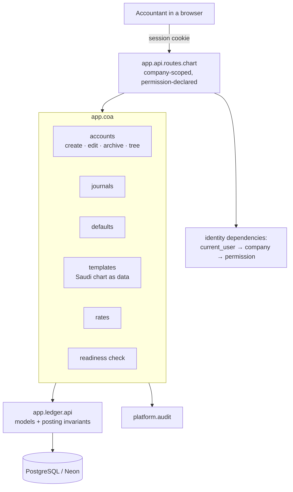

# Feature Design

## Overview

A new module, **`app.coa`**, sitting above the ledger and below the API: it owns the rules
for *managing* the chart, while `app.ledger` keeps owning the tables and every posting
invariant. Nothing here changes how posting works.

Shape of the decisions:

- **Rules that protect posted data go in the database**, as in the ledger: a new trigger
  refuses a parent that is not a group account, a parent of a different type, and any cycle
  in the hierarchy. The service checks the same things first, for a good error message.
- **Archive, never delete**, once an account has lines or is a company default — matching
  the ledger's rule that posted data is permanent.
- **The Saudi template is data**, a Python table of accounts, journals and defaults, loaded
  in one transaction so a failure leaves the company untouched.
- **The API is company-scoped and thin**: every endpoint lives under
  `/api/v1/companies/{company_id}/…`, declares its permission, and inherits sessions, the
  origin check and problem details from `identity-and-access`.
- **Defaults grow with the ledger's needs**: migration `0003` adds the receivable, payable,
  outstanding receipts/payments and suspense accounts alongside the rounding and FX ones
  the ledger already has.

## Architecture

**Layering.** `app.api` → `app.coa` → `app.ledger` → `app.platform` → `app.shared`, enforced
by import-linter. `app.coa` never imports identity: the API layer resolves the caller and
hands services a `company_id` and an `Actor`, so the chart rules stay testable without a
request.

**Request shape.** All endpoints are `/api/v1/companies/{company_id}/…`, so identity's
`requires(...)` dependency checks the permission in that company, and an unknown or
forbidden company gives the same 403 (`R14.AC3`–`R14.AC5`).

## Options Considered

### Option A — A new `app.coa` module above the ledger (chosen)

- Summary: management services live in their own module; the ledger keeps tables, posting
  and invariants.
- Why chosen: keeps `app.ledger` small and about one thing — the books. The chart grows
  screens, templates and readiness reporting that a posting engine should not carry, and
  the import-linter layer makes the direction of dependency explicit.

### Option B — Extend `app.ledger` with management services

- Summary: put `create_account`, templates and rates inside the ledger module.
- Why rejected: the ledger is the one module every other module depends on; adding template
  data and HTTP-shaped concerns to it makes that dependency heavier for invoicing, payments
  and payroll later, for no gain.

### Option C — Generic "settings" CRUD over the tables

- Summary: one generic table-driven CRUD layer for accounts, journals and rates.
- Why rejected: the interesting part of this feature is the rules (hierarchy, in-use,
  defaults suitability, template atomicity). A generic layer would push all of them into
  the API handlers or into the client.

### Sub-decisions

| Question | Choice | Why |
|---|---|---|
| Hierarchy safety | Service check **and** a database trigger | Same philosophy as the ledger: raw SQL must not be able to build a cycle (`R2.AC3`–`R2.AC5`) |
| Cycle detection | Recursive CTE walking ancestors on insert/update | Reads only the ancestor chain; no extra columns to maintain |
| Template storage | Python data + a loader in one transaction | Reviewable in a diff, translatable, and `R6.AC7` falls out of the transaction |
| Extra defaults | New columns on `ledger_settings` (migration 0003) | Typed, foreign-keyed and company-scoped, unlike a JSON blob |
| Rate import | One request, per-row results | `R7.AC6` wants every valid row recorded and every rejection explained, which a fail-fast import cannot do |
| Deleting accounts | Only when unused and not a default, else archive | Keeps history resolvable (`R3`) |

## Simplicity And Elegance Review

- Simplest viable shape: six service files, one migration, one router, one template table.
  No new dependency, no generic framework, no caching.
- Challenge applied to the first draft: a `chart_template` database table and a
  `account_closure` table (for fast subtree queries) were both cut. Templates are code, and
  a company's chart is small enough that a single recursive CTE builds the tree in one query.
- Coupling check: `app.coa` takes ids and an `Actor`; it never sees a request, a session or
  a `Caller`. That keeps every rule testable directly against the database.
- Future-proofing deferred: templates for other countries, importing a chart from a
  spreadsheet, rate feeds from a provider, and account-level analytic tags.

## Components And Interfaces

### Migration `0003_chart_of_accounts`

- Purpose: extra default-account columns on `ledger_settings`; the hierarchy trigger;
  indexes for chart listing.
- Inputs/Outputs: `alembic upgrade head`; `downgrade` removes the columns and the trigger.
- Requirements: `R2.AC3`, `R2.AC4`, `R2.AC5`, `R5.AC2`

### `app.coa.accounts`

- Purpose: the rules for creating, changing, archiving and listing accounts.
- Inputs/Outputs:
  - `create_account(session, company_id, data, actor) -> Account`
  - `update_account(session, company_id, account_id, changes, actor) -> Account`
  - `archive_account(session, company_id, account_id, actor) -> Account`
  - `delete_account(session, company_id, account_id, actor) -> None`
  - `list_chart(session, company_id, *, include_archived=False, search=None) -> list[ChartRow]`
    — one recursive CTE returning each account with its depth, ordered by code within parent
  - Raises `DomainError` with `coa.*` codes.
- Requirements: `R1`, `R2`, `R3`

### `app.coa.journals`

- Purpose: journal management, including the bank/cash default-account rule.
- Inputs/Outputs: `create_journal`, `update_journal`, `archive_journal`, `list_journals`.
- Requirements: `R4`

### `app.coa.defaults`

- Purpose: the company's default accounts and what each one may point at.
- Inputs/Outputs: `get_defaults(session, company_id) -> Defaults` (with `missing`),
  `set_default(session, company_id, key, account_id, actor) -> Defaults`.
  `DEFAULT_SUBTYPES` maps each default to the subtypes it accepts (`R5.AC3`).
- Requirements: `R5`

### `app.coa.templates`

- Purpose: the Saudi chart as data, plus an all-or-nothing loader.
- Inputs/Outputs: `TEMPLATES: dict[str, ChartTemplate]`;
  `load_template(session, company_id, key, actor) -> TemplateResult` (counts of accounts,
  journals and defaults created). Refuses a company that already has accounts.
- Requirements: `R6`

### `app.coa.rates`

- Purpose: exchange rate entry and bulk import.
- Inputs/Outputs: `set_rate(session, company_id, currency, on, rate, actor) -> ExchangeRate`
  (replaces an existing rate for that day), `list_rates(session, company_id, currency)`,
  `import_rates(session, company_id, rows, actor) -> ImportResult` with `recorded` and
  `rejected: list[(row, reason)]`.
- Requirements: `R7`

### `app.coa.readiness`

- Purpose: "is this chart ready to keep books?"
- Inputs/Outputs: `check(session, company_id) -> list[Finding]` where a finding has a code,
  a message and the ids it refers to: missing defaults, bank/cash journals without an
  account, childless group accounts, active currencies with no rate, empty chart.
- Requirements: `R8`

### `app.api.routes.chart`

- Purpose: the HTTP surface, all under `/api/v1/companies/{company_id}`.

| Method and path | Permission |
|---|---|
| `GET /accounts` | `account:read` |
| `POST /accounts` | `account:manage` |
| `PATCH /accounts/{account_id}` | `account:manage` |
| `POST /accounts/{account_id}/archive` | `account:manage` |
| `DELETE /accounts/{account_id}` | `account:manage` |
| `GET /journals` | `journal:read` |
| `POST /journals` | `journal:manage` |
| `PATCH /journals/{journal_id}` | `journal:manage` |
| `POST /journals/{journal_id}/archive` | `journal:manage` |
| `GET /defaults` | `account:read` |
| `PUT /defaults/{key}` | `account:manage` |
| `GET /chart-templates` | `chart:load` |
| `POST /chart-templates/{key}/load` | `chart:load` |
| `GET /exchange-rates` | `rate:read` |
| `PUT /exchange-rates` | `rate:manage` |
| `POST /exchange-rates/import` | `rate:manage` |
| `GET /chart-readiness` | `account:read` |

- Requirements: `R9`, `R10`, `R11`, `R12`, `R13`, `R14`

### Permission catalogue additions

- `account:read`, `account:manage`, `journal:read`, `journal:manage`, `rate:read`,
  `rate:manage`, `chart:load` added to `app.platform.access.permissions`. The existing
  start-up sync adds them to the table and grants them to Administrator, so no migration is
  needed (`R14.AC1`, `R14.AC2`).

## Data Models

Only additions; the ledger's tables are unchanged.

| Table | Change |
|---|---|
| `ledger_settings` | New nullable columns: `receivable_account_id`, `payable_account_id`, `outstanding_receipts_account_id`, `outstanding_payments_account_id`, `suspense_account_id`, each with a composite foreign key `(x_account_id, company_id) → account(id, company_id)` |
| `account` | New index on `(company_id, parent_id, code)` for tree listing; no column changes |

**Default accounts and what they accept** (`R5.AC3`):

| Default | Accepted subtypes |
|---|---|
| `receivable` | `receivable` |
| `payable` | `payable` |
| `rounding` | `expense`, `other_income` |
| `fx_gain` | `other_income`, `income` |
| `fx_loss` | `expense` |
| `outstanding_receipts`, `outstanding_payments` | `current_asset`, `current_liability`, `bank_cash` |
| `suspense` | `current_asset`, `current_liability` |

**Hierarchy trigger** (`account_hierarchy_guard`, BEFORE INSERT OR UPDATE on `account`):

1. A parent must be a group account, else `coa.parent_not_group`.
2. A parent must have the same `type`, else `coa.parent_type_mismatch`.
3. Walking ancestors with a recursive CTE must not reach the account itself, else
   `coa.hierarchy_cycle`.

**Saudi template** (`templates.SAUDI`): roughly 45 accounts with Arabic and English names
grouped under `1 Assets`, `2 Liabilities`, `3 Equity`, `4 Income`, `5 Expenses`, including
VAT input and output, withholding tax payable, Zakat provision, end-of-service provision,
GOSI payable, FX gain and loss, rounding, retained earnings and current-year earnings; the
sales, purchases, bank, cash and general journals; and every company default.

## Error Handling

| Code | HTTP | Raised when |
|---|---|---|
| `coa.duplicate_code` | 409 | Account or journal code already used in the company (`R1.AC4`, `R4.AC3`) |
| `coa.invalid_subtype` | 422 | Subtype does not belong to the type (`R1.AC5`) |
| `coa.missing_field` | 422 | Empty code or name (`R1.AC6`) |
| `coa.invalid_journal_code` | 422 | Journal code is not 1–8 upper-case letters or digits (`R4.AC4`) |
| `coa.account_in_use` | 409 | Type/subtype change or deletion of an account with lines (`R1.AC7`, `R3.AC3`) |
| `coa.journal_in_use` | 409 | Code change on a journal with posted entries (`R4.AC5`) |
| `coa.parent_not_group`, `coa.parent_type_mismatch`, `coa.hierarchy_cycle`, `coa.has_children` | 422 | Hierarchy rules (`R2`) |
| `coa.parent_not_found`, `coa.account_not_found`, `coa.journal_not_found` | 404 | Unknown, or belonging to another company (`R2.AC6`, `R4.AC7`, `R9.AC7`) |
| `coa.account_archived` | 409 | Posting to, or defaulting to, an archived account (`R3.AC2`, `R5.AC4`) |
| `coa.account_is_default` | 409 | Archiving an account a default points at (`R3.AC5`) |
| `coa.default_subtype_mismatch` | 422 | Default pointed at an unsuitable subtype (`R5.AC3`) |
| `coa.group_account` | 422 | A group account used as a default (`R5.AC6`) |
| `coa.chart_not_empty` | 409 | Loading a template into a company that has accounts (`R6.AC5`) |
| `coa.template_not_found` | 404 | Unknown template key |
| `coa.invalid_rate` | 422 | Rate of zero or less (`R7.AC3`) |
| `coa.base_currency_rate` | 422 | A rate for the company's own base currency (`R7.AC4`) |

`coa.*` codes are added to the problem-details map; everything else (401, 403, CSRF) comes
from identity unchanged (`R14.AC6`).

## Security Considerations

- Every endpoint is company-scoped and permission-declared; the start-up route check fails
  the build if one is added without a declaration.
- Reads are as scoped as writes: `account:read` in *that* company, so a chart cannot be
  browsed across companies.
- An account id from another company is answered as "not found", so ids cannot be probed
  (`R9.AC7`).
- Every change is audited with the code of what changed (`R9.AC8`, `R10.AC5`, `R11.AC4`,
  `R12.AC4`); no secrets are involved in this feature.

## Failure Modes And Tradeoffs

- Failure mode: a template load fails halfway, leaving a half-built chart.
  - Mitigation: one transaction; the endpoint commits only on success (`R6.AC7`).
- Failure mode: a deep or malicious hierarchy makes the recursive CTE expensive.
  - Mitigation: the ancestor walk is bounded by depth, and a depth limit of 10 is enforced
    with `coa.hierarchy_too_deep`; charts are small.
  - Tradeoff: a legitimate chart deeper than 10 levels would be refused; none exist.
- Failure mode: archiving an account that reports still depend on.
  - Mitigation: archiving keeps the row and its lines; only posting is refused (`R3.AC1`).
- Failure mode: a bulk rate import half-applies.
  - Mitigation: valid rows are recorded and rejected rows reported, deliberately, because a
    single bad row should not discard a month of rates (`R7.AC6`).
  - Tradeoff: the caller must read the response rather than rely on the status code.
- Failure mode: default-account rules drift from the ledger's expectations.
  - Mitigation: `DEFAULT_SUBTYPES` is the single source, used by the service and asserted in
    a test against the ledger's subtype list.
- Tradeoff: the hierarchy rules now live in two places (service and trigger). Accepted for
  the same reason as the ledger's invariants, and both are tested.

## Testing Strategy

| Layer | Location | Needs DB | What it proves |
|---|---|---|---|
| Unit | `tests/unit/` | No | Template data integrity (codes unique, parents exist, subtypes valid, every default mapped, Arabic present); `DEFAULT_SUBTYPES` covers every default and only real subtypes; journal code validation |
| Chart services | `tests/coa/` | Yes | Account create/edit/archive/delete rules; hierarchy including cycles; journals; defaults; template load and its atomicity; rates and bulk import; readiness findings |
| Invariants | `tests/invariants/test_hierarchy.py` | Yes | The trigger refuses a non-group parent, a type mismatch and a cycle **via raw SQL** |
| API | `tests/api/test_chart.py` | Yes | Every endpoint's happy path, 401 without a session, 403 without the permission, 403 for another company, 404 for another company's account, and audit records |
| Architecture | `lint-imports` | No | `app.coa` sits above `app.ledger` and never imports identity |

## Verification Plan

- Requirement proof: every acceptance criterion maps to a named test; each task carries the
  exact command.
- Test evidence:
  - `uv run pytest tests/unit -n 2`
  - `TEST_DATABASE_URL=… uv run pytest tests/coa tests/invariants tests/api -n 2`
  - `uv run ruff check . && uv run lint-imports`
  - Full suite plus concurrency before the pull request.
- Operational evidence: the readiness endpoint on the seeded demo company reports no
  findings after the Saudi template is loaded.

## Requirement Coverage

| Requirement | Covered By |
| --- | --- |
| `R1` | `coa.accounts` create/update, duplicate and in-use checks; chart service tests |
| `R2` | `coa.accounts` parent rules plus `account_hierarchy_guard`; service + raw-SQL invariant tests |
| `R3` | `archive_account`, `delete_account`, chart listing filter; service tests |
| `R4` | `coa.journals` including the bank/cash default-account rule; service tests |
| `R5` | `coa.defaults`, `DEFAULT_SUBTYPES`, migration 0003 columns; service tests |
| `R6` | `coa.templates` Saudi data and transactional loader; unit + service tests |
| `R7` | `coa.rates` set/list/import; service tests |
| `R8` | `coa.readiness`; service tests |
| `R9` | `GET/POST/PATCH /accounts`, archive and delete endpoints; API tests |
| `R10` | Journal endpoints; API tests |
| `R11` | Defaults endpoints; API tests |
| `R12` | Template endpoints; API tests |
| `R13` | Exchange-rate endpoints including import; API tests |
| `R14` | Catalogue additions, company-scoped paths, `requires(...)`, start-up route check; API tests |
| `NFR1` | Ledger invariant tests re-run unchanged in the full suite |
| `NFR2` | Archive-not-delete rules; service tests |
| `NFR3` | Template data test asserting an Arabic name on every account |
| `NFR4` | import-linter layers: `app.api` → `app.coa` → `app.ledger` |
| `NFR5` | Transactional template load and rate import; service tests |
| `NFR6` | `coa.*` codes added to the problem-details map; API tests assert the shape |
