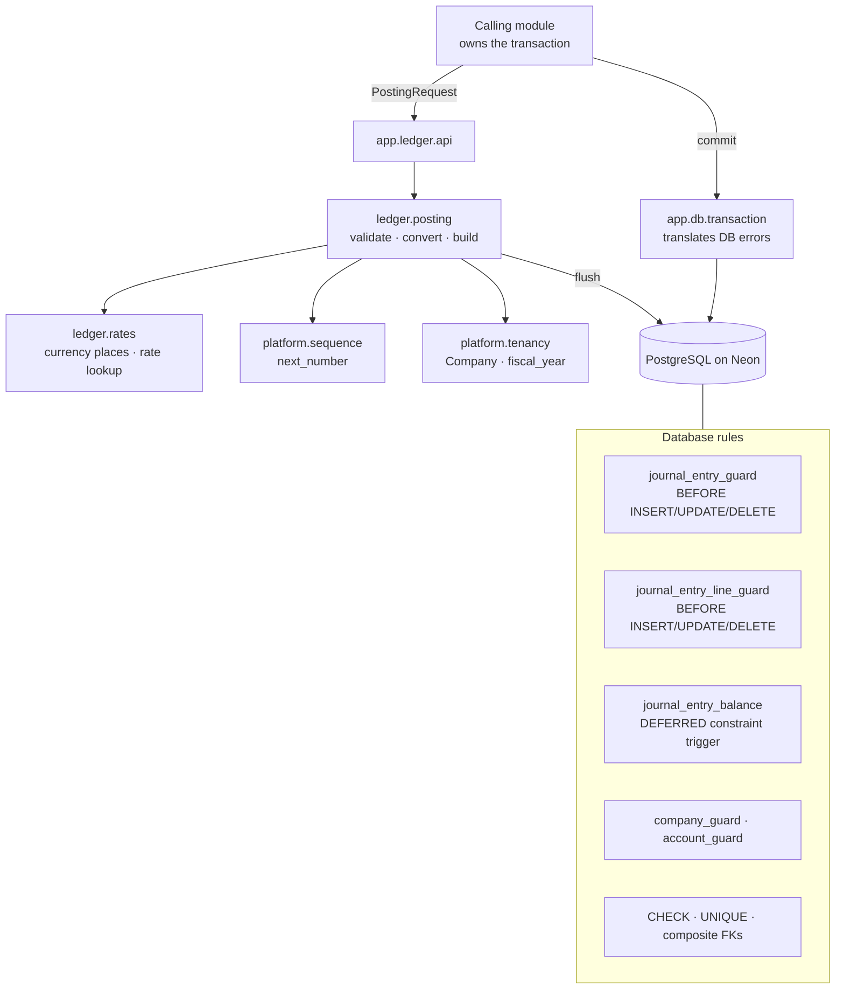

# Feature Design

## Overview

The core ledger is a **thin Python posting service over a self-defending PostgreSQL
schema**. The service validates requests, converts currencies, assigns numbers and writes
rows; PostgreSQL constraints and triggers independently enforce every invariant, so the
books stay correct even if the service has a bug or someone writes raw SQL.

Key choices (all consistent with `docs/architecture.md` §5–§6 and decisions D1, D8, D12):

- **Two-step posting inside one transaction:** insert the entry as `draft` with its lines,
  then `UPDATE` it to `posted`. Triggers make `posted` a one-way, immutable state.
- **Balance checked at COMMIT** by a deferred constraint trigger, so an entry can be built
  line by line but can never commit unbalanced.
- **Gapless numbers from a counter-row upsert**, whose row lock lasts until the posting
  transaction ends; a rollback gives the number back.
- **Row locks instead of SERIALIZABLE** (`READ COMMITTED` + `FOR SHARE` / `FOR UPDATE`),
  so concurrent posting never needs retry loops.
- **Composite foreign keys `(x_id, company_id)`** make cross-company references impossible.
- **Errors keep one shape end to end:** triggers raise `ledger.<code>: detail`; Python
  translates them into `DomainError(code, message)`.

## Architecture

**Posting sequence** (one transaction, owned by the caller):

1. Load company and journal; reject unknown company / foreign or archived journal.
2. Validate the request in its own currency (pure function).
3. Look up the rate (1 for base currency); convert lines; add a rounding line if needed.
4. `next_number()` upserts the counter row for `(company, "journal:<id>", fiscal year)` —
   this row lock serializes posting **per journal and fiscal year only**.
5. Flush: `INSERT journal_entry (draft)` + `INSERT journal_entry_line` × n. The line
   trigger takes `FOR SHARE` on the entry row and checks rounding, base-currency
   consistency and group accounts.
6. Flush: `UPDATE journal_entry SET state='posted', number, posted_at`. The entry trigger
   takes `FOR SHARE` on the company row and checks the lock date and reversal target.
7. Caller commits → deferred balance trigger checks debits = credits, single-currency
   balance and non-empty entry → commit succeeds or the whole transaction rolls back.

**Reversal sequence:** `SELECT original FOR UPDATE` → reject draft / already reversed →
build lines with debit↔credit swapped and `amount_currency` negated, company amounts
copied (not re-converted) → steps 4–7 with `reversed_entry_id` set.

**Module boundaries:** `app.ledger` depends on `app.platform.{tenancy,sequence}` and
`app.shared`; nothing below imports `app.ledger`. Other modules import only
`app.ledger.api`. Enforced with import-linter layers + independence contracts.

## Options Considered

### Option A — Database-enforced invariants + thin Python posting service (chosen)

- Summary: CHECK/UNIQUE/composite FKs and plpgsql triggers enforce every invariant;
  Python handles validation messages, conversion, numbering and row construction.
- Why chosen: meets `R3.AC9` and `NFR1` (raw SQL cannot bypass rules) while keeping
  business logic (conversion, rounding line, reversal construction) in testable Python.
  Explicit row locks give deterministic concurrency (`R11`) without retries.

### Option B — Application-only validation with SERIALIZABLE transactions

- Summary: all rules in Python services; SERIALIZABLE isolation prevents races; retry on
  serialization failures.
- Why rejected: fails `R3.AC9`/`NFR1` — any other code path or raw SQL can write
  unbalanced or edited entries. Retry loops add complexity to every caller, and
  serialization failures under load make posting latency unpredictable.

### Option C — Posting entirely inside a PostgreSQL function (`post_entry(jsonb)`)

- Summary: one stored procedure validates, converts, numbers and inserts.
- Why rejected: moves conversion/rounding logic into plpgsql, which is harder to unit
  test (no Hypothesis property tests), harder to evolve with invoicing/tax needs, and
  duplicates Python domain types. Triggers still needed for raw-SQL safety, so it adds
  code rather than removing it.

### Numbering sub-options

| Option | Verdict |
|---|---|
| Counter-row upsert with row lock held to commit (chosen) | Gapless, rollback-safe, lock scoped per journal + year, works through PgBouncer |
| PostgreSQL `SEQUENCE` per journal | Rejected: sequences are non-transactional, rollbacks leave gaps (`R6.AC4`) |
| `pg_advisory_xact_lock` + `MAX(number)+1` | Rejected: extra query on a growing table, text numbers need parsing, no stronger guarantee |

## Simplicity And Elegance Review

- Simplest viable shape: five tables of substance (`journal_entry`, `journal_entry_line`,
  `account`, `journal`, `sequence_counter`) plus reference data; four trigger functions and
  one deferred check; one posting module with three public functions (`post`, `reverse`,
  `get_rate`). No ORM events, no hidden hooks, no retries.
- Challenge applied to the first draft: a separate generic `updated_at` trigger and a
  `ledger_settings` table were questioned. `updated_at` is set inside the existing guard
  triggers instead of adding another trigger. `ledger_settings` stays: the rounding account
  (`R7.AC5`) needs a home, and putting account FKs on `company` would create a circular
  dependency between `company` and `account`.
- Coupling check: calling modules see only `PostingRequest`/`PostingLine` dataclasses and
  `DomainError`; they never touch ORM line objects to post. The ledger never commits
  (`R2.AC3`), so invoicing can post its entry and update the invoice atomically.
- Future-proofing: reconciliation residual columns, partner/tax foreign keys, row-level
  security and outbox events are intentionally **not** added now; each arrives with its
  feature through a new migration. The line trigger's immutability rule is the only
  place that will need a column allow-list when residuals arrive.

## Components And Interfaces

### Migration `0001_core_ledger`

- Purpose: creates all tables, indexes, seeded currencies, CHECK constraints, composite
  FKs, trigger functions and triggers.
- Inputs/Outputs: `alembic upgrade head` over the Neon direct endpoint; `downgrade` drops
  everything created.
- Dependencies: PostgreSQL 18 (verified on Neon 18.6: deferred constraint triggers, `CREATE/DROP DATABASE ... WITH (FORCE)`, built-in `uuidv7()`).
- Requirements: `R1`, `R3`, `R4`, `R6`, `R7`, `R8`, `R9`, `R10`, `R12`, `R14`

### `app.ledger.posting`

- Purpose: the only code that creates journal entries.
- Inputs/Outputs:
  - `post(session, PostingRequest) -> JournalEntry` (posted, flushed, not committed)
  - `reverse(session, company_id, entry_id, *, on=None, ref=None) -> JournalEntry`
  - Pure helpers: `validate_request(request, places) -> None`,
    `convert_lines(lines, currency, rate, base_places, rounding_account_id) -> list[LineValues]`
  - Raises `DomainError` with the codes in Error Handling.
- Dependencies: `ledger.models`, `ledger.rates`, `platform.sequence.api`,
  `platform.tenancy.api`, `shared.{errors,ids,money}`.
- Requirements: `R2`, `R5`, `R6.AC1`, `R6.AC3`, `R7`, `R12.AC2`, `R13.AC1`

### `app.ledger.rates`

- Purpose: currency precision and exchange-rate lookup.
- Inputs/Outputs: `currency_places(session, code) -> int`;
  `get_rate(session, company, code, on) -> Decimal` — latest `rate_date <= on`, `1` for base.
- Dependencies: `ExchangeRate`, `Currency`.
- Requirements: `R7.AC2`, `R7.AC7`, `R7.AC8`

### `app.platform.sequence.api`

- Purpose: gapless counters for any document scope.
- Inputs/Outputs: `next_number(session, company_id, scope, period) -> int`, implemented as
  `INSERT … ON CONFLICT DO UPDATE SET next_number = next_number + 1 RETURNING next_number - 1`.
- Dependencies: `sequence_counter` table.
- Requirements: `R6.AC2`, `R6.AC4`, `R11.AC1`, `R11.AC6`

### `app.platform.tenancy.api`

- Purpose: `Company` and `Currency` models; `fiscal_year(on, start_month) -> int`.
- Requirements: `R6.AC3`, `R9.AC4`

### `app.shared`

- `errors.DomainError(code, message)` and `domain_error_from_db(DBAPIError) -> DomainError | None`
  (parses `^<module>.<code>: ` from the PostgreSQL primary message).
- `money.quantize(amount, places)` (ROUND_HALF_UP = PostgreSQL `round()`), `is_rounded`.
- `ids.uuid7()`.
- `db.Base` with `Decimal → NUMERIC(20,6)` mapping.
- Requirements: `R7.AC4`, `R13`, `NFR2`

### `app.db`

- Purpose: engine factories and the unit of work.
- Inputs/Outputs: `sqlalchemy_url(url)` (forces `postgresql+psycopg`),
  `make_engine(url, pooled, pool_size)` (`pool_pre_ping=True`; pooled →
  `prepare_threshold=None`), `pooled_engine()`, `direct_engine()`,
  `transaction(engine=None)` context manager (commit, rollback, translate DB errors).
- Requirements: `R13.AC2`, `R13.AC3`, `R14.AC1`, `R14.AC2`, `R14.AC3`

### `app.main`

- Purpose: FastAPI app with `GET /api/v1/health` (runs `SELECT 1` on the pooled engine).
- Requirements: `R14.AC4`, `R14.AC5`

### Test harness (`tests/conftest.py`, `tests/factories.py`, `infra/scripts/`)

- Purpose: per-worker throwaway databases on a Neon branch; factories for a test company
  with accounts, journals, settings and rates; raw-SQL helpers that bypass the service.
- Inputs/Outputs: `TEST_DATABASE_URL` (direct endpoint of a long-lived `test` Neon branch);
  database name `ledger_test_<worker>_<random>` so parallel runs (local + CI) never collide.
  `infra/scripts/neon-branch.sh` creates/resets/deletes branches and prints connection strings.
- Requirements: `R15`, `NFR7`

<!-- assumed: one long-lived "test" Neon branch with per-run databases is simpler than creating a branch per run; per-run branches can be added in CI later without changing conftest -->

## Data Models

| Table | Key columns | Rules |
|---|---|---|
| `currency` | `code` PK, `decimal_places` 0–4 | Seeded (`C5`) |
| `company` | `id`, `base_currency`, `fiscal_year_start_month`, `lock_date` | `company_guard`: base currency fixed once entries exist (`R9.AC4`) |
| `sequence_counter` | PK `(company_id, scope, period)`, `next_number` | Upsert row lock (`R6`, `R11.AC1`) |
| `exchange_rate` | `company_id`, `currency_code`, `rate_date`, `rate NUMERIC(24,12)` | `rate > 0` (`R7.AC9`); unique per company/currency/date (`R7.AC10`) |
| `account` | `company_id`, `code`, `type`, `subtype`, `parent_id`, `is_reconcilable`, `is_group` | Type/subtype CHECK (`R10.AC3`); receivable/payable reconcilable (`R10.AC4`); `account_guard` (`R10.AC2`); `UNIQUE(id, company_id)` for composite FKs |
| `journal` | `company_id`, `code` `^[A-Z0-9]{1,8}$`, `type`, `active` | `UNIQUE(id, company_id)` |
| `ledger_settings` | `company_id` PK, `rounding_account_id`, `fx_gain_account_id`, `fx_loss_account_id` | Composite FKs to same-company accounts |
| `journal_entry` | `company_id`, `journal_id`, `number`, `date`, `state`, `currency_code`, `reversed_entry_id`, `source_type`, `source_id`, `posted_at` | `journal_entry_guard`; deferred `journal_entry_balance`; unique `(journal_id, number)` (`R6.AC5`); unique `reversed_entry_id` (`R11.AC5`); unique `(source_type, source_id)` (`R12.AC1`); composite FKs to journal and reversed entry (`R9.AC2`, `R9.AC3`); posted ⇒ number and posted_at |
| `journal_entry_line` | `entry_id`, `company_id`, `line_no`, `account_id`, `debit`, `credit`, `currency_code`, `amount_currency`, `partner_id`, `tax_id`, `tax_grid_tag`, `tax_base`, `due_date` | `debit,credit ≥ 0` (`R3.AC4`); one-sided (`R3.AC5`); sign agreement `(debit-credit)*amount_currency ≥ 0` (`R3.AC6`); `journal_entry_line_guard` (`R3.AC7`, `R3.AC8`, `R4.AC3`, `R10.AC1`); composite FKs to entry (cascade for drafts) and account (`R9.AC1`) |

**Entry state machine:**

```mermaid
stateDiagram-v2
  [*] --> draft: INSERT (posted rejected: ledger.insert_posted)
  draft --> draft: UPDATE lines/header (R1.AC2)
  draft --> [*]: DELETE (cascades lines)
  draft --> posted: UPDATE state (lock date + reversal target checked;<br/>balance checked at COMMIT)
  posted --> posted: any UPDATE/DELETE rejected (ledger.posted_immutable)
```

**Trigger responsibilities:**

| Trigger | When | Checks | Locks |
|---|---|---|---|
| `journal_entry_guard` | BEFORE INSERT/UPDATE/DELETE on entry | insert must be draft; posted rows immutable; on draft→posted: lock date, reversal target posted; sets `updated_at` | `FOR SHARE` on company when posting (`R8.AC2`) |
| `journal_entry_line_guard` | BEFORE INSERT/UPDATE/DELETE on line | parent not posted; debit/credit rounded to base places; `amount_currency` rounded to line currency; base-currency lines `amount_currency = debit − credit`; not a group account | `FOR SHARE` on entry (`R11.AC3`, `R11.AC4`) |
| `journal_entry_balance` | AFTER INSERT/UPDATE on entry, DEFERRABLE INITIALLY DEFERRED | if posted: lines exist and debit > 0; Σdebit = Σcredit; single currency ⇒ Σamount_currency = 0 | reads at commit time, so it sees lines committed by concurrent transactions it waited for |
| `company_guard` | BEFORE UPDATE on company | base currency fixed once entries exist; sets `updated_at` | — |
| `account_guard` | BEFORE UPDATE on account | cannot become group with lines; sets `updated_at` | — |

## Error Handling

| Code | Raised by | Requirement |
|---|---|---|
| `ledger.too_few_lines`, `negative_amount`, `two_sided_line`, `zero_line`, `unbalanced`, `unrounded`, `invalid_source` | `validate_request` | `R2.AC4`–`R2.AC9`, `R12.AC2` |
| `ledger.company_not_found`, `journal_not_found`, `journal_inactive` | `post`/`reverse` loaders | `R2.AC10`–`R2.AC12` |
| `ledger.currency_not_found`, `rate_missing` | `rates` | `R7.AC7`, `R7.AC8` |
| `ledger.rounding_account_missing` | `convert_lines` | `R7.AC6` |
| `ledger.entry_not_found`, `reverse_unposted`, `already_reversed` | `reverse` | `R5.AC6`–`R5.AC8` |
| `ledger.insert_posted`, `posted_immutable`, `period_locked`, `reverse_unposted` | `journal_entry_guard` | `R1.AC3`, `R4`, `R8.AC1` |
| `ledger.posted_immutable`, `unrounded`, `base_amount_mismatch`, `group_account` | `journal_entry_line_guard` | `R3.AC7`, `R3.AC8`, `R4.AC3`, `R10.AC1` |
| `ledger.unbalanced`, `unbalanced_currency`, `empty_entry` | deferred balance trigger (at COMMIT) | `R3.AC1`–`R3.AC3` |
| `ledger.base_currency_locked`, `account_has_lines` | company/account guards | `R9.AC4`, `R10.AC2` |
| CHECK / UNIQUE / FK violations | PostgreSQL constraints (no code prefix → original `IntegrityError` re-raised) | `R3.AC4`–`R3.AC6`, `R6.AC5`, `R7.AC9`, `R7.AC10`, `R9.AC1`–`R9.AC3`, `R10.AC3`, `R10.AC4`, `R12.AC1`, `R13.AC3` |

- Translation happens in two places: `posting._flush()` (errors during posting, `R13.AC1`)
  and `db.transaction()` (errors at commit, `R13.AC2`). Both roll back.
- `convert_lines` asserts the conversion difference stays within `n × 0.5` minor units; a
  larger difference is a programming error (`AssertionError`), not a user error.
- No retries anywhere in this feature: row locks make concurrent posting wait, not fail.

## Security Considerations

- Neon connection strings live in `backend/.env` (git-ignored) and Railway variables;
  `.env.example` documents names only.
- Only demo/test data may be stored while on Neon/Railway (constitution Hard Rules).
- Database role privileges and row-level security are out of scope (permissions feature);
  the triggers already prevent destructive edits to posted data regardless of role.

## Failure Modes And Tradeoffs

- Failure mode: unbalanced entry only detected at COMMIT, far from the call site.
  - Mitigation: `validate_request` rejects unbalanced requests before any SQL; the deferred
    check is the backstop for raw SQL and bugs; `transaction()` translates it (`R13.AC2`).
  - Tradeoff: accepted, because deferral is what allows lines to be inserted one by one.
- Failure mode: posting throughput limited by the per-journal counter lock.
  - Mitigation: lock scope is `(company, journal, fiscal year)` and held only for the
    posting transaction; callers keep posting transactions short.
  - Tradeoff: gapless numbering inherently serializes numbering within a scope.
- Failure mode: deadlock between a posting and a lock-date change.
  - Mitigation: fixed lock order in posting (counter → entry → company `FOR SHARE`); the
    lock-date change takes only the company row. No cycle exists unless one transaction
    both posts and edits the lock date, which callers must not do.
- Failure mode: Neon compute suspended → first query fails on a stale pooled connection.
  - Mitigation: `pool_pre_ping=True` replaces dead connections (`R14.AC3`).
- Failure mode: prepared statements through PgBouncer transaction mode fail intermittently.
  - Mitigation: `prepare_threshold=None` on pooled engines (`R14.AC1`).
- Failure mode: ORM models drift from hand-written SQL migrations.
  - Mitigation: schema drift test compares `Base.metadata` with the migrated database.
- Failure mode: trigger logic in plpgsql is less visible than Python.
  - Mitigation: every trigger branch has a raw-SQL test; triggers live in one migration file
    with comments.
- Failure mode: interrupted test runs leave `ledger_test_*` databases on the Neon branch.
  - Mitigation: `neon-branch.sh reset test` recreates the branch; databases are
    uniquely named so leftovers never break later runs.
- Amended by `financial-reports` (migration `0006`): `tax_base` records the amount a tax was
  charged on, so the VAT return can be rebuilt from posted entries alone rather than from the
  documents beside them. Additive and nullable, with `CHECK (tax_base IS NULL OR tax_grid_tag
  IS NOT NULL)`. The `ledger.zero_line` rule is deliberately **not** relaxed: a zero-amount
  tax group is recorded by tagging its base line instead of by posting an empty line.
- Tradeoff: `partner_id` and `tax_id` have no foreign keys yet (`C4`); added by the partner
  and tax features' migrations.

## Testing Strategy

| Layer | Location | Needs DB | What it proves |
|---|---|---|---|
| Unit | `tests/unit/` | No | `validate_request` error codes; `convert_lines` (examples + Hypothesis property: always balanced, sign-consistent, bounded rounding); `quantize` matches PostgreSQL half-away-from-zero; `fiscal_year`; Neon URL normalization; `domain_error_from_db` parsing; `uuid7` |
| Invariants (raw SQL) | `tests/invariants/` | Yes | Every trigger/constraint rejects bad writes without the service: `R1.AC3`, `R3`, `R4`, `R6.AC5`, `R7.AC9`, `R7.AC10`, `R8.AC1`, `R9`, `R10`, `R12.AC1`; draft edits allowed (`R1.AC2`) |
| Ledger service | `tests/ledger/` | Yes | `post`/`reverse` behaviour and error codes, numbering format and fiscal years, rate lookup, rounding line, caller-owned transaction, error translation during flush and at commit, schema drift |
| Concurrency | `tests/concurrency/` | Yes (direct endpoint) | Threads with separate connections: same-journal gapless numbering, different journals don't wait, failed postings keep numbering gapless, line insert vs posting in both orders, concurrent reversal, posting vs lock-date change |
| API | `tests/api/` | Partly | Health 200 with DB (test engine), 503 with an unreachable engine |
| Architecture | `lint-imports` | No | Layer and independence contracts |

Concurrency tests use `threading.Barrier` to start work together and `SET LOCAL
lock_timeout = '10s'` so a regression fails fast instead of hanging.

## Verification Plan

- Requirement proof: each acceptance criterion maps to at least one named test; task
  verification commands run the matching test module with `-n 2` or fewer workers.
- Test evidence:
  - `uv run pytest tests/unit` — pure logic, runs anywhere.
  - `TEST_DATABASE_URL=… uv run pytest tests/invariants tests/ledger tests/api -n 2`
  - `TEST_DATABASE_URL=… uv run pytest tests/concurrency` (single process; threads inside).
  - `uv run lint-imports` and `uv run ruff check .`
- Operational evidence: none for this feature (no deployed service yet); the health
  endpoint is the hook Railway will use.

## Requirement Coverage

| Requirement | Covered By |
| --- | --- |
| `R1` | `journal_entry_guard` (insert must be draft), draft UPDATE/DELETE path; invariant tests |
| `R2` | `ledger.posting.post`, `validate_request`, loaders; unit + service tests |
| `R3` | CHECK constraints, `journal_entry_line_guard`, deferred `journal_entry_balance`; raw-SQL invariant tests |
| `R4` | `journal_entry_guard`, `journal_entry_line_guard`; invariant tests |
| `R5` | `ledger.posting.reverse`, unique `journal_entry_one_reversal`; service tests |
| `R6` | `platform.sequence.next_number`, `fiscal_year`, unique `journal_entry_number_uniq`; service + concurrency tests |
| `R7` | `ledger.rates`, `convert_lines`, `ledger_settings`, `exchange_rate` constraints; unit (Hypothesis) + service tests |
| `R8` | `journal_entry_guard` lock-date check with company `FOR SHARE`; invariant + concurrency tests |
| `R9` | Composite FKs, `company_guard`; invariant tests |
| `R10` | `account` CHECKs, `account_guard`, line guard group check; invariant tests |
| `R11` | Counter-row lock, entry `FOR SHARE` in line guard, `FOR UPDATE` in reverse, deferred balance check; concurrency tests |
| `R12` | Unique `journal_entry_one_per_source`, `validate_request`; invariant + unit tests |
| `R13` | `shared.errors.domain_error_from_db`, `posting._flush`, `db.transaction`; unit + service tests |
| `R14` | `app.db.make_engine`, migrations env on direct engine, `app.main` health route; unit + API tests |
| `R15` | `tests/conftest.py` engine fixture, `infra/scripts/neon-branch.sh`; harness exercised by every DB test |
| `NFR1` | Database triggers and constraints; raw-SQL invariant tests |
| `NFR2` | `NUMERIC(20,6)`, `Decimal` mapping, `quantize`; unit tests |
| `NFR3` | `READ COMMITTED` + explicit row locks; concurrency tests |
| `NFR4` | Counter scope `(company, journal, fiscal year)`; different-journal concurrency test |
| `NFR5` | Immutability triggers, `reversed_entry_id`; invariant + reversal tests |
| `NFR6` | import-linter contracts in `pyproject.toml`; `lint-imports` |
| `NFR7` | Neon-only test harness; no local database configuration |
