# Feature Design

## Overview

A new module, **`app.reporting`**, above `app.treasury`. It writes nothing. Every figure it
returns is a sum over posted `journal_entry_line` rows, and the reports are tested against
each other and against zero.

The shape of it:

- **One balance query, three statements.** Trial balance, profit and loss and balance sheet
  are the same query — opening, debits, credits and closing per account — presented three
  ways. It selects **from the chart** and left-joins the lines, so every account appears
  whether it moved or not, and a statement is one round trip rather than three: the balance
  sheet's fiscal-year movement is a conditional sum in the same query as its closing
  balances. Against a hosted database that difference is the whole of `NFR3`. They cannot disagree about a number because they read the same number. That is what
  makes `R10.AC1` (P&L net result equals the movement in current-year earnings) true by
  construction rather than by careful arithmetic in two places.
- **Cash flow needs no allocation.** For every entry that touches a bank or cash account,
  the *non-cash* lines are classified by their own account's cash flow tag. They sum exactly
  to the cash movement, because the entry balances — so there is no pro-rata split, no
  rounding remainder, and no arbitrary choice when one payment covers three things (`R4.AC5`).
- **Aged reports have two honest paths.** As of today, a line's open amount is the one the
  ledger already holds. As of a past date, it has to be rebuilt by subtracting only the
  matches whose settling entry is dated on or before that date — a payment received in April
  must not settle a March invoice on the March report (`R5.AC3`, `R5.AC4`). A test asserts the
  two paths agree when the date is today.
- **The hierarchy is built in Python.** A chart is tens to hundreds of accounts, and a tree
  with subtotals is clearer and far easier to test as a pure function than as a recursive CTE.
- **The VAT return needs something the ledger does not yet record.** See below; it is the
  only part of this feature that changes anything outside it.

## The VAT return's missing basis

`R6.AC1` needs the **net amount and the tax amount** for each ZATCA box. Today the ledger
has only the tax:

- A tax line carries `tax_id` and `tax_grid_tag`, but not the amount it was charged on. For
  a 15% tax the base could be reverse-engineered as `tax ÷ rate`, which is arithmetic
  standing in for a fact.
- **A zero-rated supply leaves no trace at all.** Its tax group is worth 0.00, and
  `build_posting_request` ends with
  `lines=tuple(line for line in lines if line.debit or line.credit)`, so the line is dropped
  to satisfy the ledger's `ledger.zero_line` rule. A 5,000 SAR export posts two lines and no
  grid tag — boxes 3, 4 and 5 of the return cannot be built from posted entries.

The constitution forbids a report reading anything but posted journal entries, so reading the
base back off `document_line` is not available, and it would be the wrong answer anyway: a
VAT return that cannot be rebuilt from the ledger is a second set of books.

**Chosen: record the basis on the line that carries the tag.**

1. `journal_entry_line` gains **`tax_base`** — the amount this tax was charged on. Additive;
   every existing column and rule is untouched.
2. A tax line carries `tax_base = group.base` alongside the `tax_grid_tag` it already has.
3. Where a tax group is worth nothing — zero-rated, exempt, out of scope — there is no tax
   line to carry anything, so **the base line carries the tag instead**: the posting line for
   that document line gets the group's `tax_grid_tag` and `tax_base`.
4. `IF a document line carries two different zero-amount taxes`, one posting line cannot hold
   both tags, so posting is refused with `tax.ambiguous_zero_rated` rather than silently
   reporting one of them.

This leaves the `ledger.zero_line` rule alone. The alternative — permitting a zero-amount line
when it carries a tax, so that every group gets exactly one uniform line — is tidier to read
and is what several ERPs do, but it weakens a ledger invariant that the whole system is built
on, and it would contradict an approved core-ledger requirement rather than extend it.

**Cross-feature effects, checked against the approved specs and shipped code:**

| Feature | Effect |
|---|---|
| `core-ledger` | One new nullable column on `journal_entry_line`, carried through `PostingLine` → `LineValues`. No invariant changes; `ledger.zero_line` stands. Design amended, additively. |
| `invoicing-and-vat` | `build_posting_request` sets `tax_base` on tax lines and tags base lines for zero-amount groups. Its own requirements (per-line rounding, grouping by tax) are unchanged. Design amended. |
| `payments-and-reconciliation` | Withholding tax lines already carry `tax_id` and `tax_grid_tag`; they gain a base the same way. No behavioural change. |
| `chart-of-accounts` | Untouched. The reports read `cash_flow_tag`, `subtype` and `parent_id`, all of which exist. |
| `identity-and-access` | One new permission, `report:read`. Additive. |

## Architecture

```mermaid
flowchart TD
  api["app.api.routes.reports<br/>company-scoped · report:read"] --> reporting
  subgraph reporting["app.reporting"]
    periods["periods<br/>fiscal years, named periods"]
    balances["balances<br/>ONE query + the account tree"]
    statements["statements<br/>trial balance · P&L · balance sheet"]
    cashflow["cash_flow"]
    aged["aged<br/>receivables · payables"]
    vat["vat_return"]
    detail["detail<br/>the lines behind a figure"]
  end
  balances --> statements
  periods --> statements
  reporting --> treasury["app.treasury<br/>reconciliation rows"]
  reporting --> billing["app.billing<br/>partner names"]
  reporting --> coa["app.coa<br/>accounts, defaults"]
  reporting --> ledger["app.ledger<br/>entries and lines"]
  ledger --> db[(PostgreSQL / Neon)]
```



**Layering:** `app.main → app.api → app.reporting → app.treasury → app.billing → app.coa →
app.ledger → app.platform → app.shared`, enforced by import-linter.

## Options Considered

### Option A — One balance primitive, presented several ways (chosen)

- Summary: `account_balances()` returns opening, debit, credit and closing per account for a
  period. The trial balance is that result; the P&L is it filtered to income and expense; the
  balance sheet is it for assets, liabilities and equity plus two computed earnings rows.
  Cash flow, aged and VAT have their own queries because they group by something else.
- Why chosen: the three statements that must agree are literally reading the same rows, so
  the reconciliation requirements in `R10` hold by construction. One query to optimise, one
  place to fix, and the tree-building is a pure function that can be unit-tested with no
  database.

### Option B — A hand-written SQL query per report

- Summary: six independent queries, each shaped for its report.
- Why rejected: six chances for the same figure to be computed two ways. The reconciliation
  tests would then be catching real drift rather than confirming a structural guarantee —
  which is exactly the failure mode the requirements exist to prevent.

### Option C — Materialise daily balances and read those

- Summary: maintain `ledger_daily_balance` from posted lines and read reports from it.
- Why rejected: it is the Phase 2 answer for dashboards, and the architecture already says so.
  For Phase 1 it adds a cache that can disagree with the ledger, to solve a performance
  problem nobody has yet — `NFR3` asks for two seconds over a fiscal year, which a single
  indexed aggregate delivers comfortably.

### Sub-decisions

| Question | Choice | Why |
|---|---|---|
| Cash flow classification | Classify the **non-cash** lines of cash-touching entries | They sum exactly to the cash movement, so no allocation and no rounding remainder (`R4.AC5`) |
| Cash flow: transfers between two bank accounts | Fall out naturally | Such an entry has no non-cash lines and nets to zero, so it never appears — which is correct |
| Account hierarchy | Built in Python from flat rows | Pure, testable without a database, and a chart is small |
| Aged as of a past date | Subtract matches by their **settling entry's date**, not by when someone clicked match | The money moved when the entry says it did; `matched_at` is an audit fact, not an accounting one |
| Negative open items | Kept, not hidden | A customer who overpaid shows as a credit; suppressing it would make the report disagree with the receivable account (`R5.AC5`, `R5.AC7`) |
| VAT box map | Data in the module, keyed by grid tag | Boxes are ZATCA's structure; tags are ours. New tags map to boxes without code changes |
| Report response shape | A distinct result type per report | Forcing one row type on a trial balance, an ageing and a VAT return would fit none of them |
| Rounding | None — figures are summed at full stored scale and presented as stored | Every stored amount is already rounded to the currency; summing rounded amounts needs no further rounding |
| Where reports are slow | Round trips, not row counts | A fiscal year is a few thousand rows, which Postgres aggregates in milliseconds; the time is spent waiting on the network. So the design's unit of cost is **queries per report**, and each statement is one |

## Simplicity And Elegance Review

- Simplest viable shape: one query module, one presentation module per report family, no new
  tables, no cache, and a single additive column outside the module.
- Challenge applied to the first draft: a `ReportRow` type shared by all seven reports was
  cut — the ageing buckets and the VAT boxes were being forced through a debit/credit shape
  that did not fit. A generic `Report` envelope with per-report bodies replaced it.
- Also cut: a `reporting.cache` table, and a `recursive CTE` version of the hierarchy.
- Coupling check: `app.reporting` reads models from the modules below it and calls no service
  that writes. Nothing imports `app.reporting`.
- Future-proofing deferred: `ledger_daily_balance`, dashboards, comparison against budget,
  consolidation, the indirect cash flow method — all Phase 2, none designed for here beyond
  keeping the query shape they would later feed.

## Components And Interfaces

### Migration `0006_reporting`

- `journal_entry_line.tax_base NUMERIC(20,6)` — nullable; the amount a tax was charged on.
- Backfill: for existing tax lines whose tax has a non-zero rate, `tax_base = amount ÷ rate × 100`,
  so books that already exist report correctly. Zero-rated history cannot be recovered and is
  left null, which the return reports as untagged rather than inventing a figure.
- Seeds the `report:read` permission and grants it to Administrator.
- Requirements: `R6.AC1`, `R9.AC1`

### `app.reporting.periods`

- `Period(start, end, label)`; `resolve(company, *, start, end, named)` handling
  `this-fiscal-year`, `last-fiscal-year`, `q1`–`q4`, `this-month`, and explicit ranges,
  against the company's fiscal year start month.
- `fiscal_year_bounds(company, on) -> (start, end)`; reuses `app.platform.tenancy.fiscal_year`.
- Pure but for reading the company; no database work beyond that.
- Requirements: `R8.AC2`, `R8.AC3`, `R3.AC5`, `R1.AC7`

### `app.reporting.balances`

- `account_balances(session, company_id, period, *, types=None, journal_id=None) -> list[AccountBalance]`
  — one SQL aggregate returning opening, debit, credit and closing per non-group account.
- `tree(balances, accounts) -> list[BalanceNode]` — pure; nests by `parent_id` and subtotals
  upward.
- Requirements: `R1`, `R2.AC4`, `R3.AC7`, `R8.AC6`

### `app.reporting.statements`

- `trial_balance(...) -> TrialBalance`
- `profit_and_loss(..., comparison=False) -> ProfitAndLoss` — gross profit, net result
- `balance_sheet(session, company_id, as_of) -> BalanceSheet` — with `current_year_earnings`
  and `retained_earnings` computed from the same primitive over two date windows
- Requirements: `R1`, `R2`, `R3`, `R10.AC1`, `R10.AC2`

### `app.reporting.cash_flow`

- `cash_flow(session, company_id, period) -> CashFlow` — opening cash, sections for operating,
  investing, financing and unclassified, net movement, closing cash.
- Requirements: `R4`, `R10.AC3`

### `app.reporting.aged`

- `aged_receivables(session, company_id, as_of, *, partner_id=None) -> Aged`
- `aged_payables(...)` — the same function against payable accounts
- `open_amount_as_of(...)` — the historic reconstruction, used only when `as_of` is in the past
- Requirements: `R5`, `R10.AC4`

### `app.reporting.vat_return`

- `vat_return(session, company_id, period) -> VatReturn` — one row per ZATCA box with net and
  tax, output and input separated, net tax due, and an `untagged` section.
- `BOXES: Mapping[str, VatBox]` — grid tag → box number and bilingual label.
- Requirements: `R6`, `R10.AC5`

### `app.reporting.detail`

- `account_detail(session, company_id, account_id, period, *, partner_id=None) -> AccountDetail`
  — posted lines with a running balance from the opening balance, and the document behind each.
- Requirements: `R7`, `R10.AC6`

### `app.api.routes.reports`

All under `/api/v1/companies/{company_id}/reports`, all `GET`, all `report:read`:

| Path | Returns |
|---|---|
| `/trial-balance` | `R1` |
| `/profit-and-loss` | `R2` |
| `/balance-sheet` | `R3` |
| `/cash-flow` | `R4` |
| `/aged-receivables`, `/aged-payables` | `R5` |
| `/vat-return` | `R6` |
| `/accounts/{account_id}/detail` | `R7` |

Every response carries the same envelope: company, currency, period, `generated_at`, then the
report's own body. Every row that stands for an account carries its `account_id`, so a screen
can link a figure to its detail (`R9.AC4`).

- Requirements: `R9`, `R8.AC1`, `R8.AC4`

## Data Models

No new tables. One new column, and one new permission.

| Table | Change | Rules |
|---|---|---|
| `journal_entry_line` | **new:** `tax_base NUMERIC(20,6)` nullable | The amount a tax was charged on. Set by the posting path for lines that carry a `tax_grid_tag`; null everywhere else. `CHECK (tax_base IS NULL OR tax_grid_tag IS NOT NULL)` — a basis without a tag would be unreportable and is therefore a mistake |
| `permission` | **new row:** `report:read` | Granted to Administrator by the migration |

**In-memory result types** (frozen dataclasses, all carrying a `ReportMeta`):
`TrialBalance`, `ProfitAndLoss`, `BalanceSheet`, `CashFlow`, `Aged`, `VatReturn`,
`AccountDetail`.

**The balance query**, in outline:

```sql
SELECT a.id, a.code, a.name, a.name_ar, a.type, a.subtype, a.parent_id,
       SUM(CASE WHEN e.date <  :start THEN l.debit - l.credit ELSE 0 END) AS opening,
       SUM(CASE WHEN e.date >= :start THEN l.debit  ELSE 0 END)           AS debit,
       SUM(CASE WHEN e.date >= :start THEN l.credit ELSE 0 END)           AS credit
FROM journal_entry_line l
JOIN journal_entry e ON e.id = l.entry_id
JOIN account a       ON a.id = l.account_id
WHERE l.company_id = :company AND e.state = 'posted' AND e.date <= :end
GROUP BY a.id, a.code, a.name, a.name_ar, a.type, a.subtype, a.parent_id
```

Served by the existing indexes `journal_entry (company_id, date)` and
`journal_entry_line (company_id, account_id)`; closing is `opening + debit - credit`.

## Error Handling

| Code | HTTP | Raised when |
|---|---|---|
| `reporting.invalid_period` | 422 | End before start, an unparseable date, or an unknown named period (`R1.AC7`, `R9.AC5`) |
| `reporting.account_not_found` | 404 | Account detail for an unknown account, or another company's |
| `reporting.no_fiscal_year` | 409 | A company whose fiscal year start month is unset — should be impossible, and is reported rather than guessed |
| `tax.ambiguous_zero_rated` | 422 | Posting a document line carrying two different zero-amount taxes, where one posting line cannot hold both tags |

## Security Considerations

- Every endpoint is company-scoped and needs `report:read`. A report reveals the whole
  financial position, so it is a permission of its own rather than an implication of
  `account:read`.
- Another company's figures are unreachable: the company comes from the path, the role check
  from the session, and every query filters on `company_id`.
- Reports open a read-only path; `NFR6` is tested by asserting no write occurs during one.

## Failure Modes And Tradeoffs

- Failure mode: a report is produced while an entry is being posted, and shows half of it.
  - Mitigation: each report runs in one transaction, so it sees one consistent snapshot. A
    half-posted entry is never visible because posting commits atomically.
- Failure mode: the aged report as of a past date disagrees with the receivable balance then.
  - Mitigation: `R10.AC4` is a test, not a hope — for a random past date across generated
    histories.
- Failure mode: a zero-rated supply posted before this migration has no recoverable basis.
  - Mitigation: the backfill recovers what arithmetic can (non-zero rates) and the return
    lists the rest as untagged, which is visible and correctable, rather than inventing it.
  - Tradeoff: accepted. Fabricating a figure for a legal return would be worse than showing a
    gap.
- Failure mode: a company with an enormous chart makes the tree slow.
  - Mitigation: the tree is built from the aggregate's rows, so its size is the number of
    accounts, not the number of entries.
- Tradeoff: the P&L's comparison period runs the balance query a second time rather than
  widening the first. Two clear queries beat one clever one, and `NFR3` has room for it.

## Testing Strategy

| Layer | Location | Needs DB | What it proves |
|---|---|---|---|
| Unit | `tests/unit/test_periods.py`, `tests/unit/test_account_tree.py`, `tests/unit/test_vat_boxes.py` | No | Fiscal years and named periods against odd start months; tree nesting and subtotals; every grid tag maps to a box |
| Reports | `tests/reporting/` | Yes | Each report against a known, hand-built set of entries where the right answer is obvious |
| Reconciliation | `tests/reporting/test_reconciles.py` | Yes | The whole of `R10`: P&L against the balance sheet, cash flow against the cash accounts, ageing against the receivable balances, VAT against the VAT accounts, detail against the trial balance |
| Property | `tests/reporting/test_properties.py` | Yes | Hypothesis generates random sequences of invoices, bills, payments, partial matches, foreign-currency settlements and reversals, then asserts every `R10` identity and that the trial balance is zero |
| Invariants | `tests/invariants/test_tax_base.py` | Yes | The `tax_base`/`tax_grid_tag` check constraint refuses a basis with no tag |
| API | `tests/api/test_reports.py` | Yes | Each endpoint, `report:read`, cross-company 404/403, and the period parameters |
| Architecture | `lint-imports` | No | `app.reporting` above `app.treasury`, and nothing imports it |

## Verification Plan

- Requirement proof: every acceptance criterion maps to a named test; tasks carry the command.
- Test evidence: the unit suite; `tests/reporting tests/invariants tests/api -n 2`; then ruff,
  import-linter and the full suite before the pull request.
- Operational evidence: the property test is the real evidence — it builds books nobody
  designed and asserts the reports still agree with them.

## Requirement Coverage

| Requirement | Covered By |
| --- | --- |
| `R1` | `balances.account_balances` and `statements.trial_balance`; report + property tests |
| `R2` | `statements.profit_and_loss` over the same primitive; report tests |
| `R3` | `statements.balance_sheet` with computed earnings; report + reconciliation tests |
| `R4` | `cash_flow` classifying non-cash counterpart lines; report + reconciliation tests |
| `R5` | `aged` with the today and as-of-past paths; report + reconciliation tests |
| `R6` | `vat_return` and the `tax_base` the migration adds; report tests |
| `R7` | `detail.account_detail`; report tests |
| `R8` | `periods.resolve` and company scoping in every query; API tests |
| `R9` | `app.api.routes.reports`; API tests |
| `R10` | `tests/reporting/test_reconciles.py` and the Hypothesis property test |
| `NFR1` | No cache, no new tables; every query filters `state = 'posted'` |
| `NFR2` | `Decimal` throughout, base currency only; unit + report tests |
| `NFR3` | One indexed aggregate per report; a timing test over a generated fiscal year |
| `NFR4` | import-linter layers |
| `NFR5` | `reporting.*` codes in the problem-details map; API tests |
| `NFR6` | A test asserting a report writes nothing |
