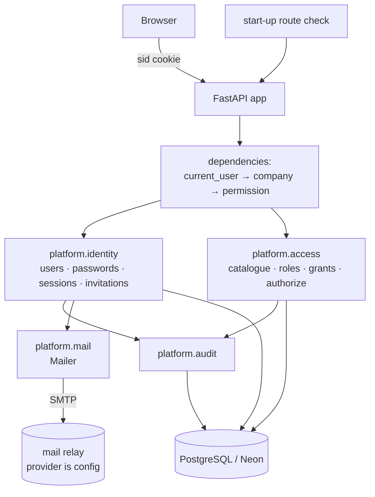
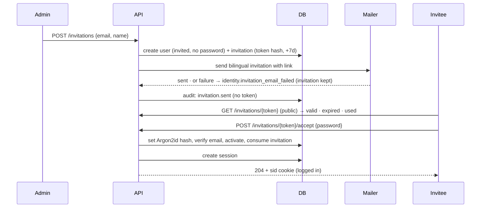
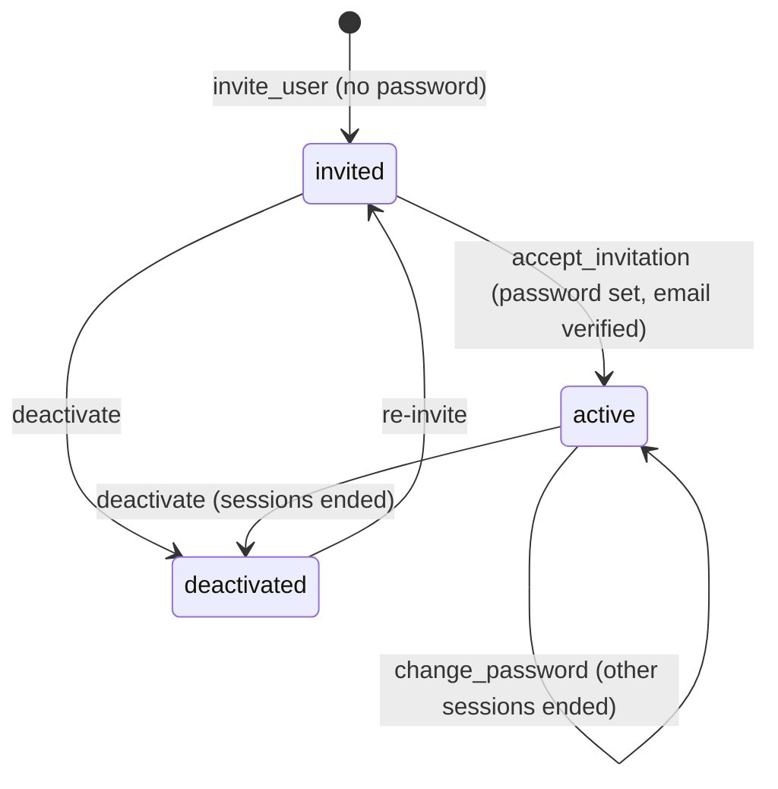

# Feature Design

## Overview

Four small platform modules and one shared HTTP layer:

- **`platform.identity`** — users, passwords, invitations, sessions. Owns "who is this".
- **`platform.access`** — permissions catalogue, roles, grants per company, the authorization
  check. Owns "may they do this, here".
- **`platform.audit`** — append-only security log, kept append-only by a database trigger.
- **`platform.mail`** — a `Mailer` interface with SMTP, log and recording backends.

Shape of the decisions:

- **Server-side sessions**, not stateless tokens: a random 32-byte token in a `HttpOnly`
  cookie, stored only as a SHA-256 hash, so deactivating a user or revoking a session takes
  effect on the next request (`R1.AC6`, `R4.AC8`).
- **Invitations use the same token shape** — random, hashed, single-use, 7-day expiry — so
  nobody but the invitee ever knows the password (`R1.AC10`, `R11`).
- **Fail closed at start-up**: every route must declare a permission or be explicitly
  public, checked while the app boots, so an unprotected endpoint cannot ship (`R7.AC2`).
- **Cookie-authenticated writes must come from our own origin**, enforced by one middleware
  ahead of routing, with `SameSite=Lax` as the browser-side half (`R12`).
- **Same answer for every login failure**, including a hash verification against a dummy
  hash when the email address is unknown, so neither the message nor the timing reveals
  which addresses exist (`R3.AC3`, `R3.AC8`).
- **Email is an interface, not a provider choice**: SMTP in production, a log backend when
  no relay is configured, a recording backend in tests. No provider account is needed to
  build, test or demo this feature (`C3`, `R11.AC15`).

## Architecture



**Request path for a protected endpoint:**

1. `current_user` reads the `sid` cookie, hashes it, loads the session with its user in one
   query, rejects unknown/ended/expired sessions with 401, and stamps `last_used_at`.
2. `current_company` (only on company-scoped routes) confirms the user holds a role in the
   company in the path; anything else — no role, or no such company — is an identical 403.
3. `require("<resource>:<action>")` checks the permission the route declared against the
   caller's permissions for that company; missing means 403.
4. The endpoint runs, and anything security-relevant is appended to the audit log.

**Invitation path:**



**Module boundaries.** `identity` and `access` sit at the same level and never import each
other: `access.authorize(user_id, company_id, permission)` takes ids, not user objects. Both
may use `audit`; only `identity` uses `mail`. The import-linter contract becomes a layered
one where `app.platform.identity:app.platform.access` form one independent layer above
`app.platform.audit`, `app.platform.mail`, `app.platform.tenancy` and
`app.platform.sequence`.

## Options Considered

### Option A — Server-side sessions in PostgreSQL (chosen)

- Summary: random opaque token in a cookie; a `user_session` row holds its hash, expiry and
  last use.
- Why chosen: revocation is immediate and auditable, which the requirements demand
  (`R1.AC6`, `R1.AC8`, `R4.AC8`); storage cost is one row per login; a session lookup is one
  indexed query, joined with the user (`NFR4`).

### Option B — Stateless signed tokens (JWT) in the cookie

- Summary: sign the user id and expiry; verify per request with no database read.
- Why rejected: cannot revoke. Deactivating a user or ending sessions after a password change
  would need a denylist table, which brings back exactly the state Option A keeps — while
  also making the secret's rotation a new problem.

### Option C — A hosted identity provider (Neon Auth, Auth0, Keycloak)

- Summary: delegate users, login and sessions to an external service or a self-hosted IdP.
- Why rejected: `docs/architecture.md` §2 approved first-party sessions with OIDC as a later
  addition; an external identity store also raises a PDPL data-residency question before the
  product exists. The chosen shape keeps `authorize()` unchanged if OIDC is added later —
  only session creation would move.

### Sub-decisions

| Question | Choice | Why |
|---|---|---|
| Invitation token | Random 32 bytes, stored hashed, single use | Revocable and resendable; a signed stateless token cannot be invalidated (`R11.AC8`, `R11.AC9`) |
| Password hashing | `argon2-cffi` `PasswordHasher` with `needs_rehash` | Argon2id is approved in §2; the library gives parameter upgrades for free (`R2.AC4`) |
| Email templating | Plain Python string templates + stdlib `email.message` and `smtplib` | Two emails do not justify a template engine dependency |
| Lockout state | `login_attempt` rows counted over a 15-minute window | Auditable, needs no cache, and the same rows answer "was this address under attack" |
| Permission catalogue | Python constants, seeded into a `permission` table | Code is the source of truth; the table gives foreign keys and a join for role permissions |
| CSRF | `SameSite=Lax` cookie plus an `Origin`/`Sec-Fetch-Site` check on unsafe methods, applied by one middleware | Cookie auth needs both: the cookie flag stops well-behaved browsers, the header check stops the rest and covers login CSRF (`R12`). A per-form synchroniser token was rejected: with no cross-origin browser client, it adds state and a handshake for nothing |

## Simplicity And Elegance Review

- Simplest viable shape: seven tables, four modules, three FastAPI dependencies, one
  middleware, one start-up check. No queue, no cache, no template engine, no external identity service.
- Challenge applied to the first draft: a `session` cache keyed by token hash and a separate
  `email_verification` table were both cut. Session lookup is already one indexed query, and
  verification state is a timestamp on the user, since an invitation acceptance is the only
  thing that sets it.
- Coupling check: business modules never import identity or access models — endpoints
  receive a `Caller` value object (user id, company id, permissions) from the dependency, so
  the chart of accounts can be written against a tiny interface.
- Fail-closed over convenience: a route with no declared permission stops the app rather than
  defaulting to "authenticated users", which is the failure mode that leaks data quietly.
- Future-proofing deliberately deferred: OIDC, record-level rules, row-level security,
  password reset by email, and moving invitation mail onto the outbox once jobs exist.

## Components And Interfaces

### `platform.identity`

- Purpose: users, passwords, invitations, sessions.
- Inputs/Outputs:
  - `invite_user(session, actor, email, name) -> Invitation`
  - `accept_invitation(session, token, password) -> (User, SessionToken)`
  - `resend_invitation(session, actor, invitation_id) -> Invitation`
  - `revoke_invitation(session, actor, invitation_id) -> None`
  - `authenticate(session, email, password) -> User` (raises `DomainError`)
  - `start_session(session, user, user_agent, ip) -> SessionToken`
  - `load_session(session, raw_token) -> Session | None`
  - `end_session`, `end_all_sessions(user_id)`, `change_password`, `deactivate_user`
- Dependencies: `platform.mail`, `platform.audit`, `shared.*`.
- Requirements: `R1`, `R2`, `R3`, `R4`, `R9`, `R11`

### `platform.identity.passwords`

- Purpose: Argon2id hashing behind one seam.
- Inputs/Outputs: `hash_password`, `verify_password(hash, password) -> bool`,
  `needs_rehash(hash) -> bool`, `verify_dummy()` (constant-work path for unknown emails).
- Requirements: `R2.AC1`, `R2.AC4`, `R2.AC5`, `R3.AC8`

### `platform.identity.tokens`

- Purpose: one place that mints and hashes opaque secrets.
- Inputs/Outputs: `new_token() -> str` (32 bytes, base64url), `token_hash(raw) -> str`
  (SHA-256 hex), `constant_time_equals`.
- Requirements: `R4.AC2`, `R11.AC4`

### `platform.access`

- Purpose: the permission catalogue, roles, grants, and the authorization check.
- Inputs/Outputs:
  - `PERMISSIONS: frozenset[str]` — the catalogue, as `<resource>:<action>` constants
  - `permissions_for(session, user_id) -> dict[UUID, frozenset[str]]` (one query, per company)
  - `authorize(permissions, company_id, permission) -> None` (pure; raises)
  - `grant_role`, `revoke_role`, `set_role_permissions`, `ensure_catalogue_seeded`
- Dependencies: `platform.audit`.
- Requirements: `R5`, `R6`, `R7.AC3`

### `platform.audit`

- Purpose: append-only security log.
- Inputs/Outputs: `record(session, actor, action, target_type=None, target_id=None,
  company_id=None, detail=None)`; `read_company_log(session, company_id, limit, before)`.
  Secrets are rejected by the writer: `detail` is a `dict` whose keys are checked against a
  deny-list (`password`, `token`, `secret`, `hash`).
- Requirements: `R8`, `R11.AC12`, `R11.AC13`

### `platform.mail`

- Purpose: outbound email without choosing a provider.
- Inputs/Outputs: `Mailer.send(message: Email) -> None` with `SmtpMailer` (stdlib `smtplib`,
  STARTTLS, credentials from settings), `LogMailer` (no relay configured), `RecordingMailer`
  (tests). `render_invitation(name, link, expires_at) -> Email` produces bilingual
  Arabic/English text and HTML parts.
- Requirements: `R11.AC1`, `R11.AC10`, `R11.AC11`, `R11.AC14`, `R11.AC15`

### HTTP layer (`app.api`)

- Purpose: the app's first real endpoints, its error shape, and its protection rules.
- Dependencies: `platform.identity.api`, `platform.access.api`.
- Endpoints:

| Method and path | Permission | Notes |
|---|---|---|
| `POST /api/v1/auth/login` | public | 204 + `sid` cookie; lockout applies |
| `POST /api/v1/auth/logout` | authenticated | Ends this session |
| `GET /api/v1/auth/me` | authenticated | Profile, companies, permissions per company |
| `POST /api/v1/auth/password` | authenticated | Current + new password; ends other sessions |
| `POST /api/v1/invitations` | `user:invite` | Creates the user and sends the email |
| `POST /api/v1/invitations/{id}/resend` | `user:invite` | Supersedes the previous link |
| `POST /api/v1/invitations/{id}/revoke` | `user:invite` | Makes the link unusable |
| `GET /api/v1/invitations/{token}` | public | Reports valid, expired or used |
| `POST /api/v1/invitations/{token}/accept` | public | Sets the password, logs the user in |
| `GET /api/v1/users` | `user:read` | No password hashes in the response |
| `POST /api/v1/users/{id}/deactivate` | `user:manage` | Ends that user's sessions |
| `POST /api/v1/users/{id}/sessions/revoke` | `user:manage` | Ends sessions without deactivating |
| `POST /api/v1/companies/{company_id}/users/{id}/roles` | `role:grant` | Grants a role in one company |
| `DELETE /api/v1/companies/{company_id}/users/{id}/roles/{role_id}` | `role:grant` | Refuses the last administrator |
| `GET /api/v1/companies/{company_id}/audit-log` | `audit:read` | Newest first |
| `GET /api/v1/health` | public | Already exists |

- Requirements: `R3`, `R7`, `R10`, `R11`

### Start-up route check

- Purpose: makes `R7.AC1`/`R7.AC2` mechanical rather than a review habit.
- Behaviour: on start-up, walk `app.routes`; every route must carry either
  `permission="<code>"` or `public=True` in its metadata, and each declared permission must
  exist in the catalogue. Anything else raises and the app does not serve.
- Requirements: `R7.AC1`, `R7.AC2`, `R7.AC5`

### Bootstrap command

- Purpose: create the first administrator on a fresh system.
- Inputs/Outputs: `uv run python -m app.cli bootstrap-admin --email … [--password …]`;
  generates and prints a password when none is given; refuses when any user exists.
- Requirements: `R9`

## Data Models

Added by migration `0002_identity_and_access`:

| Table | Columns | Rules |
|---|---|---|
| `app_user` | `id`, `email`, `name`, `password_hash` (null while invited), `state` (`invited`/`active`/`deactivated`), `email_verified_at`, `created_at`, `updated_at` | `UNIQUE (email)`; email stored lower-cased and trimmed (`R1.AC2`); `CHECK (state <> 'active' OR password_hash IS NOT NULL)`; `CHECK (email = lower(btrim(email)))` |
| `user_session` | `id`, `user_id`, `token_hash`, `created_at`, `last_used_at`, `expires_at`, `ended_at`, `user_agent`, `ip` | `UNIQUE (token_hash)`; index on `(user_id, ended_at)`; the raw token exists only in the cookie (`R4.AC2`) |
| `invitation` | `id`, `user_id`, `token_hash`, `created_by`, `created_at`, `expires_at`, `accepted_at`, `revoked_at`, `superseded_at` | `UNIQUE (token_hash)`; partial unique index: one open invitation per user; open means all three timestamps null (`R11.AC8`) |
| `permission` | `code` PK | Seeded from the Python catalogue; `CHECK (code ~ '^[a-z_]+:[a-z_]+$')` (`R5.AC1`) |
| `role` | `id`, `name`, `description`, `is_system` | `UNIQUE (name)`; the Administrator role is `is_system` and cannot be deleted (`R5.AC8`) |
| `role_permission` | `role_id`, `permission_code` | PK on both; FK to `permission(code)` so a typo cannot be granted |
| `user_company_role` | `user_id`, `company_id`, `role_id` | PK on all three; FK to `company(id)`; the join that answers `permissions_for` (`R5.AC2`, `R6.AC5`) |
| `login_attempt` | `id`, `email`, `attempted_at`, `succeeded`, `ip` | Index on `(email, attempted_at)`; rows older than a day are deleted opportunistically on write (`R3.AC5`, `R3.AC6`) |
| `audit_log` | `id`, `at`, `actor_user_id`, `actor_email`, `company_id`, `action`, `target_type`, `target_id`, `detail` (JSONB) | `audit_log_guard` trigger rejects every UPDATE and DELETE with `audit.append_only` (`R8.AC3`); index on `(company_id, at DESC)` |

**User state machine:**



**Session lifetimes:** idle limit 12 hours, absolute limit 7 days, both settings
(`R4.AC5`, `R4.AC6`). A session is valid when `ended_at IS NULL`, `expires_at > now()` and
`last_used_at > now() - idle_limit`.

## Error Handling

API errors use RFC 9457 problem details with the stable code in a `code` member:

```json
{ "type": "about:blank", "title": "Not authenticated", "status": 401,
  "code": "identity.not_authenticated", "detail": "Sign in to continue." }
```

| Code | HTTP | Raised when |
|---|---|---|
| `identity.invalid_credentials` | 401 | Unknown email, wrong password, deactivated user, invited user who has not accepted, unparseable hash (`R2.AC5`, `R3.AC3`, `R3.AC4`, `R3.AC9`) |
| `identity.too_many_attempts` | 429 | More than 10 failures for an address in 15 minutes (`R3.AC5`) |
| `identity.not_authenticated` | 401 | No cookie on a protected route (`R4.AC3`) |
| `identity.session_expired` | 401 | Unknown, ended or expired session (`R4.AC4`) |
| `identity.permission_denied` | 403 | Authenticated, permission not held (`R7.AC3`) |
| `identity.company_forbidden` | 403 | Company not in the caller's grants, or no such company (`R6.AC2`, `R6.AC3`) |
| `identity.duplicate_email`, `identity.invalid_email`, `identity.weak_password` | 422 | Invitation and password validation (`R1.AC3`–`R1.AC5`) |
| `identity.invitation_expired`, `identity.invitation_used`, `identity.invitation_invalid` | 410 / 409 / 404 | Invitation link states (`R11.AC5`–`R11.AC7`) |
| `identity.invitation_email_failed` | 502 | Invitation stored, relay refused it (`R11.AC10`) |
| `identity.role_not_found`, `identity.last_administrator`, `identity.user_in_use`, `identity.already_bootstrapped` | 404 / 409 | Role and lifecycle rules (`R5.AC5`, `R5.AC6`, `R1.AC7`, `R9.AC2`) |
| `identity.csrf_check_failed` | 403 | A cookie-authenticated write, or a login, from an origin that is not accepted (`R12.AC2`–`R12.AC4`) |
| `audit.append_only` | 500 | A bug tried to change the audit log; the trigger stopped it |

Rules: no error message names whether an email address exists; validation errors never echo
the password; the response model for users and sessions has no field for `password_hash` or
`token_hash`, so they cannot leak by accident (`R2.AC2`, `R10.AC3`).

## Security Considerations

- **Cookie**: `sid`, `HttpOnly`, `Secure`, `SameSite=Lax`, `Path=/`, no `Expires` (session
  cookie); TLS is the host's job (`C4`).
- **CSRF** (`R12`): one middleware runs before routing. For `GET` and `HEAD` it does nothing.
  For every other method, a request carrying the `sid` cookie must present either an `Origin`
  in the configured accepted set or `Sec-Fetch-Site: same-origin`; a cross-site value, a
  foreign origin, or neither header present is 403 `identity.csrf_check_failed` with an audit
  record naming the rejected origin. The login and invitation-acceptance endpoints are checked
  too, even though they carry no cookie, so login CSRF is covered. Accepted origins come from
  settings: the local development URL plus the deployed public URL (`C4b`).
- **Session fixation**: a fresh token is minted on login and on invitation acceptance; the
  password change ends every other session (`R1.AC8`).
- **Enumeration**: login and invitation lookups answer identically for unknown and known
  inputs; company mismatch and missing company are the same 403.
- **Timing**: `authenticate` always performs one Argon2id verification, against a fixed dummy
  hash when the address is unknown (`R3.AC8`).
- **Argon2id parameters**: library defaults pinned in settings (memory 64 MiB, time cost 3,
  4 lanes), with `needs_rehash` upgrading stored hashes on next login.
- **Secrets in logs**: the audit writer rejects deny-listed keys, and the mailer logs the
  link only in the log backend, which is development-only.

## Failure Modes And Tradeoffs

- Failure mode: the mail relay is down, so an invitation never reaches its recipient.
  - Mitigation: the invitation row is kept and `identity.invitation_email_failed` is
    returned; resend supersedes the token. Once jobs exist, sending moves to the outbox.
  - Tradeoff: invitation creation is not atomic with sending; accepted, and visible.
- Failure mode: lockout used as a denial of service against a known address.
  - Mitigation: the window is 15 minutes and a successful login clears it; attempts are
    recorded with their IP so abuse is visible in the audit log.
  - Tradeoff: an attacker can briefly lock a colleague out. Per-IP throttling and CAPTCHA
    belong to a later hardening pass.
- Failure mode: a route ships with no permission declared.
  - Mitigation: start-up fails; a test enumerates every route and asserts the declaration.
- Failure mode: a stale session kept alive forever by activity.
  - Mitigation: absolute limit as well as idle limit.
- Failure mode: CSRF on cookie-authenticated endpoints.
  - Mitigation: `SameSite=Lax` plus the origin-check middleware, now specified as `R12`.
  - Tradeoff: a non-browser client that sends the session cookie without an `Origin` or
    `Sec-Fetch-Site` header is refused (`R12.AC4`). That is deliberate — such callers should
    use an API credential once machine access exists — but it means `curl` needs
    `-H 'Origin: <public url>'`, and the test client sets the header explicitly.
- Failure mode: `permissions_for` called per check, causing N queries per request.
  - Mitigation: resolved once per request in the dependency and passed as a `Caller` value
    (`NFR4`).
- Failure mode: Neon's pooled endpoint drops session-level state.
  - Mitigation: authorization uses no `SET`, only per-transaction data (`NFR6`).
- Tradeoff: `argon2-cffi` is a new dependency (`C1`); the algorithm was already approved.

## Testing Strategy

| Layer | Location | Needs DB | What it proves |
|---|---|---|---|
| Unit | `tests/unit/` | No | Argon2id wrapper (hash, verify, needs_rehash, unparseable hash); token minting and hashing; `authorize` decision table; lockout window arithmetic; email rendering contains both languages and the link; audit deny-list rejects secret-ish keys; problem-details shape |
| Identity (DB) | `tests/identity/` | Yes | Invite → accept → login → logout; resend supersedes; revoke; expiry; deactivation ends sessions; password change ends other sessions; idle and absolute expiry; grants and revocation; last-administrator rule; audit trigger rejects UPDATE and DELETE |
| API | `tests/api/` | Yes | Login sets the cookie with all three flags; 401 without a cookie; 401 for expired sessions; 403 for a company without a grant, identical to a missing company; 403 without the permission; `/auth/me` shape with no secrets; invitation acceptance logs in; lockout returns 429; origin check on unsafe methods |
| Security | `tests/api/test_hardening.py` | Yes | Unknown email and wrong password give identical bodies, and both call Argon2id exactly once (spy, not wall-clock); no response body anywhere contains `password_hash` or `token_hash`; every route declares a permission or public |
| CSRF | `tests/api/test_csrf.py` | Yes | Writes with a foreign `Origin`, with `Sec-Fetch-Site: cross-site`, and with neither header are all 403 and audited; an accepted `Origin` and `same-origin` pass; `GET` is never checked; login and invitation acceptance are checked; cookies carry `SameSite=Lax` |
| Architecture | `lint-imports` | No | identity and access do not import each other; both sit above audit and mail |

Timing equality is asserted by counting verification calls, not by measuring durations, so
the suite stays deterministic on a laptop and in CI.

## Verification Plan

- Requirement proof: every acceptance criterion maps to a named test; tasks carry the exact
  command as their `Verification:` block.
- Test evidence:
  - `uv run pytest tests/unit -n 2`
  - `TEST_DATABASE_URL=… uv run pytest tests/identity tests/api -n 2`
  - `uv run pytest tests/api/test_hardening.py`
  - `uv run ruff check . && uv run lint-imports`
  - `uv run python -m app.cli bootstrap-admin --email … ` against a scratch database, twice,
    to prove the refusal (`R9.AC2`)
- Operational evidence: audit log rows for login success and failure, invitation sent,
  accepted and revoked, and role grants — read back through
  `GET /api/v1/companies/{id}/audit-log`.

## Requirement Coverage

| Requirement | Covered By |
| --- | --- |
| `R1` | `platform.identity` user services, `app_user` constraints, invitation flow; identity DB tests |
| `R2` | `identity.passwords` (Argon2id, needs_rehash), response models without hashes; unit + hardening tests |
| `R3` | `authenticate`, `login_attempt` lockout, dummy-hash constant work, `/auth/login`, `/auth/logout`; API + hardening tests |
| `R4` | `user_session` table, `identity.tokens`, `current_user` dependency, idle and absolute limits; identity + API tests |
| `R5` | `platform.access` catalogue, `role`, `role_permission`, `user_company_role`, `grant_role`, last-administrator rule; identity tests |
| `R6` | `current_company` dependency, `permissions_for` per company, identical 403s; API tests |
| `R7` | Route metadata, start-up route check, `require()` dependency; hardening tests |
| `R8` | `platform.audit`, `audit_log_guard` trigger, deny-listed detail keys, company audit endpoint; identity + unit tests |
| `R9` | `app.cli bootstrap-admin`; verification plan runs it twice |
| `R10` | `/auth/me` and its response model; API tests |
| `R11` | `invitation` table, invite/accept/resend/revoke services, `platform.mail` with three backends, bilingual template; identity + API tests |
| `R12` | CSRF middleware with configured accepted origins, audit record on rejection, `SameSite=Lax` cookies; CSRF tests |
| `NFR1` | Argon2id, hashed session and invitation tokens, cookie flags, origin check, identical failures; hardening + CSRF tests |
| `NFR2` | Start-up route check that stops the app |
| `NFR3` | Append-only trigger and audit deny-list; identity + unit tests |
| `NFR4` | `permissions_for` resolved once per request into `Caller`; one session query joined with the user |
| `NFR5` | import-linter layered contract for the platform modules |
| `NFR6` | No session-level database state in authorization; pooled-endpoint settings unchanged |
