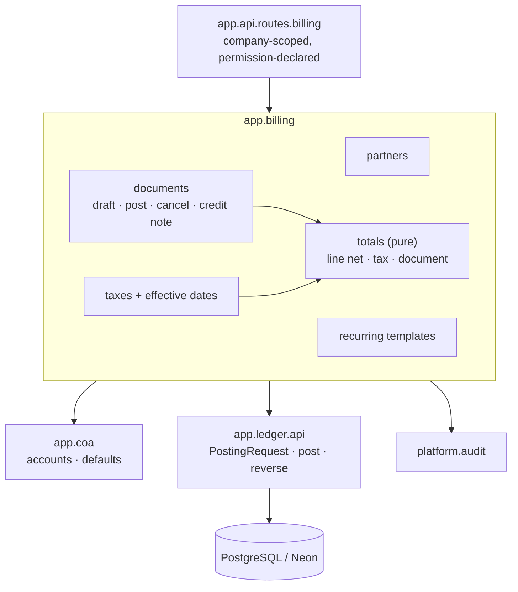
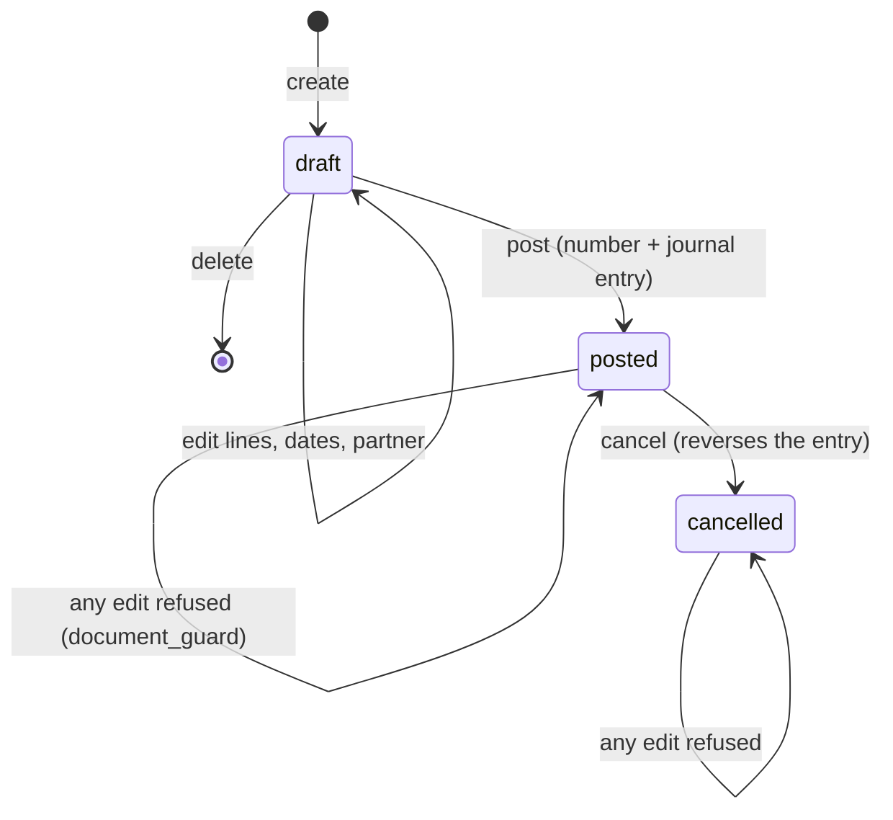

# Feature Design

## Overview

A new module, **`app.billing`**, above `app.coa` and `app.ledger`. It owns partners, taxes,
documents (invoices, bills, credit and debit notes) and recurring templates; the ledger
still owns posting, numbering and immutability.

Shape of the decisions:

- **Totals are never stored.** Line net, tax and document totals are computed by one pure
  function from the lines, used by the screen, the posting request and later by ZATCA, so
  the three can never disagree (`R2.AC9`).
- **Posting builds one `PostingRequest`** and hands it to the ledger. The ledger's existing
  unique index on `(source_type, source_id)` is what guarantees one entry per document —
  not application care (`R6.AC1`).
- **Documents are immutable once posted**, enforced by a trigger like the ledger's, so a
  direct UPDATE cannot rewrite an issued invoice (`R7.AC3`).
- **Corrections are documents, not edits**: a credit note copies the invoice, can be
  trimmed, and posts the opposite entry (`R5`).
- **ZATCA-shaped from the start**: partner VAT and CR numbers, per-line tax category and
  exemption reason, and totals per tax are all stored now, so the next feature renders XML
  without a schema change (`NFR5`).

## Architecture

**Posting sequence** (one transaction owned by the endpoint):

1. Load the document with its lines; refuse unless it is a draft with at least one line.
2. Compute totals (pure) and check every tax is effective on the document date and of the
   right type for the document.
3. Read the company's receivable or payable default; refuse if unset.
4. Build a `PostingRequest`: receivable/payable line for the total with partner and due
   date, one line per invoice line at its net amount, one line per tax group.
5. `ledger.post(...)`, then set the document's `state`, `number`, `journal_entry_id` and
   `posted_at` from the entry.
6. Audit. The caller commits; any failure leaves a draft and no entry (`R6.AC9`).

**Cancellation:** `ledger.reverse(entry)` then mark the document cancelled — the invoice
and its entry both stay (`R7.AC5`).

**Layering:** `app.api` → `app.billing` → `app.coa` → `app.ledger` → `app.platform` →
`app.shared`, enforced by import-linter.

## Options Considered

### Option A — `app.billing` module with computed totals (chosen)

- Summary: documents and taxes in their own module; totals computed on demand by a pure
  function; posting delegated to the ledger.
- Why chosen: totals cannot drift from lines, the tax rules are unit-testable without a
  database, and ZATCA can reuse the same computation for its XML.

### Option B — Stored totals maintained on every write

- Summary: keep `net_total`, `tax_total`, `total` columns updated by the service or a trigger.
- Why rejected: two sources of truth for the same number. Any missed update path shows a
  wrong invoice; the fix is a background reconciliation nobody runs. Reads are cheap here —
  a document has a handful of lines.

### Option C — Extend `app.coa` rather than a new module

- Summary: put documents next to the chart.
- Why rejected: the chart is configuration, documents are transactions with a state machine
  and a posting path. Mixing them makes both harder to reason about and would let invoicing
  reach into chart internals.

### Sub-decisions

| Question | Choice | Why |
|---|---|---|
| Tax rounding | Per line, to the currency's places, then sum | Decision D2; matches ZATCA's line-level amounts |
| Tax-inclusive pricing | Per-document flag, net derived as `price / (1 + rate)` | Decision D3; POS and B2C need it, B2B does not |
| Several taxes on a line | Each computed on the same net, never compounded | Saudi VAT is not compounded; keeps the arithmetic explainable |
| Document numbering | The ledger's gapless counter, scoped to the document's journal | One numbering mechanism in the system, already proven under concurrency |
| Immutability | Trigger on `document` and `document_line` | Same philosophy as posted journal entries |
| Credit note limit | Sum of posted credit notes may not exceed the origin's total | `R5.AC6`; checked at posting, when the amounts are final |
| Recurring generation | An endpoint/command that generates due drafts, idempotent per due date | No job runner yet (`C5`); `next_date` advance in the same transaction makes a double run harmless |

## Simplicity And Elegance Review

- Simplest viable shape: three tables (`partner`, `tax`, `document` with `document_line`,
  plus `recurring_template`), one pure totals module, one posting path, one router.
- Challenge applied to the first draft: a separate `document_tax` summary table and a
  `product` table were both cut. Tax groups are derived from lines on read, and products
  belong to the inventory feature — a line carries a description and an account.
- Coupling check: `app.billing` speaks to the ledger only through `PostingRequest`, and to
  the chart through `app.coa`'s services. ZATCA will read documents and totals, not
  re-implement them.
- Future-proofing deferred: products, price lists, payment terms with instalments, delivery
  notes, and per-line analytic tags.

## Components And Interfaces

### Migration `0004_invoicing`

- Purpose: `partner`, `tax`, `document`, `document_line`, `document_line_tax`,
  `recurring_template`; the immutability triggers; the seven new permission codes.
- Requirements: `R1`, `R3`, `R4`, `R5.AC3`, `R7.AC3`, `R7.AC4`, `R8`, `R9`

### `app.billing.partners`

- `create_partner`, `update_partner`, `archive_partner`, `list_partners`, `get_partner`.
- Validates the Saudi VAT number shape: fifteen digits, first and last `3` (`R9.AC3`).
- Requirements: `R9`

### `app.billing.taxes`

- `create_tax`, `update_tax`, `archive_tax`, `list_taxes(…, on=…)` (effective on a date),
  `install_saudi_taxes(session, company_id, actor)` for a freshly loaded chart.
- Refuses a rate change once the tax appears on a posted document (`R1.AC8`).
- Requirements: `R1`

### `app.billing.totals` (pure, no database)

- `line_amounts(quantity, unit_price, discount, taxes, places, inclusive) -> LineAmounts`
  (`net`, `taxes: list[TaxAmount]`, `gross`)
- `document_totals(lines, places) -> DocumentTotals` (`net`, `tax_groups`, `tax_total`, `total`)
- Requirements: `R2`

### `app.billing.documents`

- `create_document`, `update_document`, `delete_document` (drafts only),
- `post_document(session, company_id, document_id, actor) -> Document`
- `cancel_document(session, company_id, document_id, reason, actor) -> Document`
- `credit_note_from(session, company_id, document_id, actor) -> Document`
- `get_document`, `list_documents(filters)`
- Requirements: `R3`, `R4`, `R5`, `R6`, `R7`, `R11`

### `app.billing.recurring`

- `create_template`, `update_template`, `pause_template`, `resume_template`,
  `generate_due(session, company_id, on, actor) -> GenerationResult`.
- Idempotent: a template records `last_generated_for`, so a second run for the same due
  date creates nothing (`R8.AC5`).
- Requirements: `R8`

### `app.api.routes.billing`

All under `/api/v1/companies/{company_id}`:

| Method and path | Permission |
|---|---|
| `GET /partners`, `POST /partners`, `PATCH /partners/{id}`, `POST /partners/{id}/archive` | `partner:read` / `partner:manage` |
| `GET /taxes`, `POST /taxes`, `PATCH /taxes/{id}`, `POST /taxes/{id}/archive` | `tax:read` / `tax:manage` |
| `GET /documents`, `GET /documents/{id}` | `invoice:read` |
| `POST /documents`, `PATCH /documents/{id}`, `DELETE /documents/{id}` | `invoice:manage` |
| `POST /documents/{id}/post`, `POST /documents/{id}/cancel`, `POST /documents/{id}/credit-note` | `invoice:post` |
| `GET /recurring-templates`, `POST /recurring-templates`, `PATCH /recurring-templates/{id}` | `invoice:manage` |
| `POST /recurring-templates/generate` | `invoice:manage` |

- Requirements: `R10`

### Permission catalogue additions

`partner:read`, `partner:manage`, `tax:read`, `tax:manage`, `invoice:read`,
`invoice:manage`, `invoice:post` — seeded by migration `0004` and granted to Administrator.

## Data Models

| Table | Key columns | Rules |
|---|---|---|
| `partner` | `company_id`, `name`, `name_ar`, `type` (`customer`/`vendor`/`both`), `vat_number`, `cr_number`, `address` JSONB, `active` | `UNIQUE (company_id, vat_number)` where set; VAT shape checked in the service |
| `tax` | `company_id`, `name`, `name_ar`, `rate NUMERIC(6,3)`, `type`, `vat_category`, `exemption_reason`, `account_id`, `effective_from`, `effective_to`, `grid_tag`, `active` | `CHECK (rate BETWEEN 0 AND 100)`; composite FK to `account`; `CHECK` that a non-standard category has a reason |
| `document` | `company_id`, `type` (`out_invoice`/`in_bill`/`out_credit`/`in_debit`), `partner_id`, `journal_id`, `number`, `date`, `due_date`, `currency_code`, `state` (`draft`/`posted`/`cancelled`), `tax_inclusive`, `origin_document_id`, `vendor_reference`, `journal_entry_id`, `posted_at`, `narration` | Composite FKs to partner, journal and entry; `UNIQUE (company_id, type, number)` where number set; `UNIQUE (partner_id, vendor_reference)` where set (`R4.AC3`); posted ⇒ number and entry present |
| `document_line` | `document_id`, `company_id`, `line_no`, `description`, `description_ar`, `quantity NUMERIC(20,6)`, `unit_price NUMERIC(20,6)`, `discount_percent NUMERIC(6,3)`, `account_id` | `CHECK (quantity >= 0 AND unit_price >= 0)`; cascade from the document |
| `document_line_tax` | `line_id`, `tax_id` | PK on both; the taxes applied to a line |
| `recurring_template` | `company_id`, `partner_id`, `journal_id`, `currency_code`, `interval_months`, `next_date`, `last_generated_for`, `active`, lines as JSONB | `CHECK (interval_months BETWEEN 1 AND 12)` |

**Document state machine:**

**`document_guard` trigger** (BEFORE UPDATE OR DELETE on `document` and `document_line`):
once `state <> 'draft'`, only `state`, `cancelled_at` and `cancel_reason` may change;
deletes are refused with `invoicing.posted_immutable`.

**Saudi taxes** (`R1.AC10`): VAT 15% on sales (account 2200) and on purchases (account
1300), zero-rated 0% with reason "Export of goods outside the GCC", and exempt 0% with
reason "Exempt financial supply", each with its VAT return grid tag.

They live in `app.billing.taxes.install_saudi_taxes`, **not** in the chart template:
`app.coa` sits below `app.billing`, so the template cannot create taxes without inverting
the layers (import-linter refuses it). The chart-template endpoint loads the chart and then
installs the taxes, which is the composition point where both modules are already in hand.

## Error Handling

| Code | HTTP | Raised when |
|---|---|---|
| `tax.invalid_rate`, `tax.not_effective`, `tax.wrong_tax_type`, `tax.missing_reason` | 422 | Tax definition and use (`R1.AC6`, `R2.AC7`, `R2.AC8`, `R1.AC4`) |
| `tax.tax_in_use`, `tax.account_not_found` | 409 / 404 | `R1.AC8`, `R1.AC7` |
| `invoicing.no_lines`, `invoicing.invalid_line`, `invoicing.invalid_vat_number` | 422 | Document and partner validation (`R3.AC4`, `R3.AC5`, `R9.AC3`) |
| `invoicing.account_not_found`, `invoicing.partner_not_found`, `invoicing.document_not_found` | 404 | Cross-company or unknown references |
| `invoicing.duplicate_vendor_reference` | 409 | `R4.AC3` |
| `invoicing.posted_immutable`, `invoicing.already_posted`, `invoicing.already_cancelled` | 409 | State machine (`R7.AC3`, `R6.AC7`, `R7.AC6`) |
| `invoicing.not_posted`, `invoicing.exceeds_original` | 409 | Credit notes (`R5.AC4`, `R5.AC6`) |
| `invoicing.default_account_missing` | 409 | `R6.AC8` |

Ledger and chart errors (`ledger.period_locked`, `coa.account_archived`, …) pass through
unchanged, so an archived account or a locked period gives the message that feature already
has.

## Security Considerations

- Every endpoint is company-scoped and permission-declared; posting is a separate permission
  from editing, so a junior can prepare and a senior can issue.
- Cross-company partner, account or document ids are answered as "not found".
- Documents carry no secrets; audit records name numbers and totals only.

## Failure Modes And Tradeoffs

- Failure mode: totals recomputed on every read could be slow for a huge document.
  - Mitigation: documents have tens of lines, and the computation is arithmetic on already
    loaded rows.
  - Tradeoff: accepted deliberately over stored totals that can drift.
- Failure mode: posting fails halfway, leaving a numbered draft.
  - Mitigation: numbering happens inside the ledger's posting transaction; a failure rolls
    back both (`R6.AC9`), proven by a test that forces a locked period.
- Failure mode: a credit note is posted for more than the invoice.
  - Mitigation: the check sums posted credit notes for that origin at posting time.
  - Tradeoff: two concurrent credit notes could both pass the check; the origin row is
    locked `FOR UPDATE` during the check to close that race, and a test proves it.
- Failure mode: recurring generation runs twice and bills a customer twice.
  - Mitigation: `last_generated_for` is compared and advanced in the same transaction.
- Failure mode: a tax rate changes and old invoices appear to change with it.
  - Mitigation: rate changes are refused once used (`R1.AC8`); a new rate is a new tax with
    its own effective dates.
- Tradeoff: withholding tax is defined but not applied until payments exist, so a bill for a
  non-resident vendor shows its gross amount for now.

## Testing Strategy

| Layer | Location | Needs DB | What it proves |
|---|---|---|---|
| Unit | `tests/unit/test_totals.py` | No | Line and document arithmetic: rounding per line, discounts, several taxes, tax-inclusive pricing, zero-rate, a Hypothesis property that totals equal net plus tax and never lose a halala |
| Billing services | `tests/billing/` | Yes | Partners, taxes and effective dates, document lifecycle, posting entries line by line, credit notes and their limit, cancellation, recurring generation and its idempotence |
| Invariants | `tests/invariants/test_document_guard.py` | Yes | Raw SQL cannot edit or delete a posted document |
| API | `tests/api/test_billing.py` | Yes | Each endpoint, the three permissions, cross-company 404s, and the problem-details shape |
| Architecture | `lint-imports` | No | `app.billing` above `app.coa` and `app.ledger` |

## Verification Plan

- Requirement proof: each acceptance criterion maps to a named test; tasks carry the command.
- Test evidence: `uv run pytest tests/unit`, `… tests/billing tests/invariants tests/api -n 2`,
  `uv run ruff check . && uv run lint-imports`, then the full suite and concurrency before
  the pull request.
- Operational evidence: a seeded demo company can raise an invoice, post it, see the journal
  entry balance, credit part of it, and read the ledger back — exercised end to end in the
  service tests.

## Requirement Coverage

| Requirement | Covered By |
| --- | --- |
| `R1` | `app.billing.taxes` including `install_saudi_taxes`, `tax` table constraints; service tests |
| `R2` | `app.billing.totals`; unit tests including a property test |
| `R3` | `app.billing.documents` create/update/delete; service tests |
| `R4` | Document type `in_bill`, vendor reference uniqueness, payable posting; service tests |
| `R5` | `credit_note_from`, origin link, posting limit with `FOR UPDATE`; service tests |
| `R6` | `post_document` building one `PostingRequest`; ledger's one-entry-per-source index; service tests |
| `R7` | Ledger numbering, `document_guard` trigger, `cancel_document`; invariant + service tests |
| `R8` | `app.billing.recurring` with `last_generated_for`; service tests |
| `R9` | `app.billing.partners` including the VAT number shape; service tests |
| `R10` | `app.api.routes.billing` and its permissions; API tests |
| `R11` | Audit records on post, cancel, tax and partner changes; service + API tests |
| `NFR1` | One transaction per posting; ledger unique index; service tests |
| `NFR2` | `Decimal` throughout, per-line rounding, totals recomputed; unit tests |
| `NFR3` | Immutability trigger and credit notes; invariant tests |
| `NFR4` | import-linter layers |
| `NFR5` | Partner VAT/CR, per-line category and reason, tax groups stored or derivable; service tests assert the fields ZATCA needs |
| `NFR6` | Problem-details codes added to the map; API tests |
