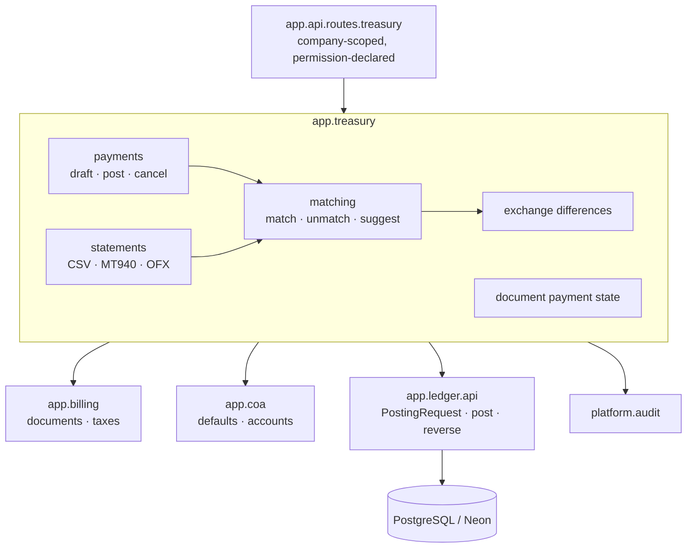
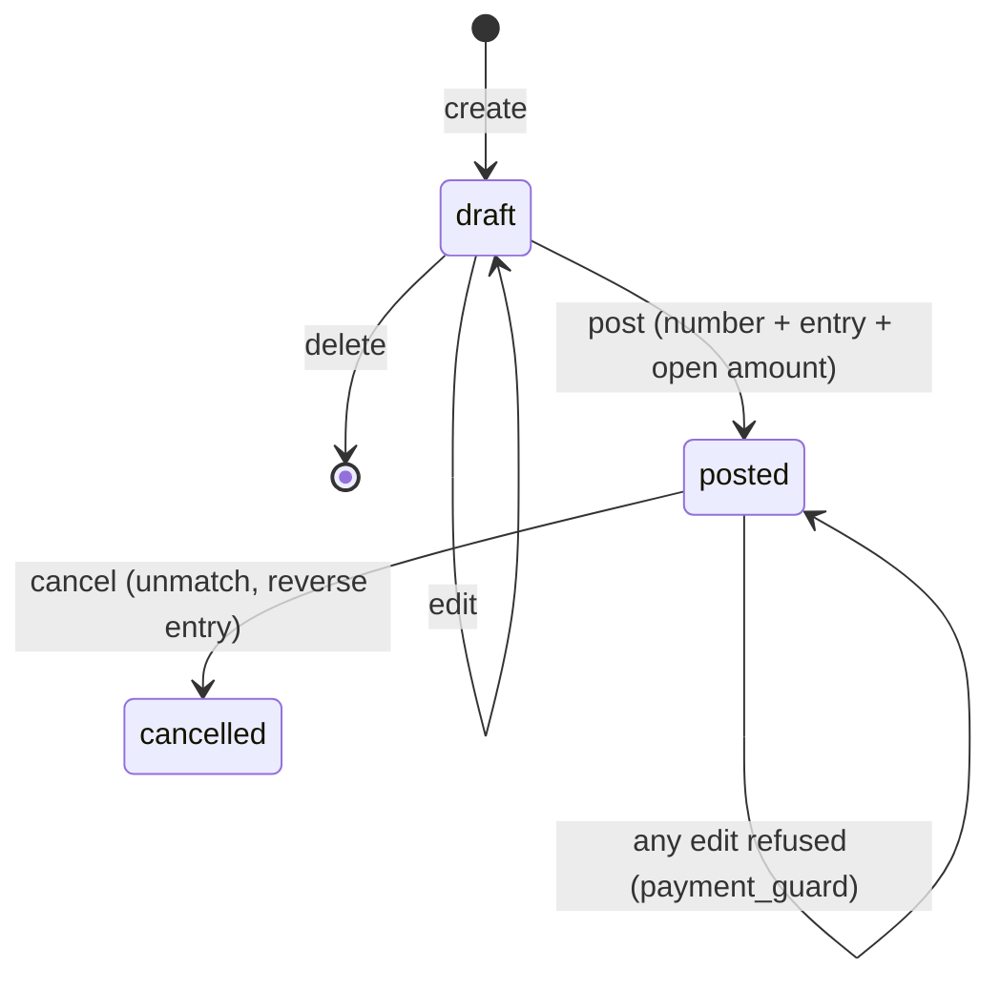

# Feature Design

## Overview

A new module, **`app.treasury`**, beside `app.billing` and above the chart and the ledger.
It owns payments, reconciliations and bank statements. Two things it adds belong to the
ledger's own tables, because the ledger reserved them for this feature:

- **Open amounts** (`residual`, `residual_currency`, `reconciled`) on `journal_entry_line`.
  The ledger's line guard currently refuses *every* update to a line of a posted entry, so
  migration `0005` replaces `journal_entry_line_guard` with a version that allows an update
  touching **only** those three columns. Everything else about a posted line stays frozen,
  and the invariant tests prove both halves.
- **A `reconciliation` table** linking a debit line to a credit line with the matched
  amount, and, where rates moved, the exchange-difference entry it caused.

Shape of the decisions:

- **The database keeps open amounts honest.** A deferred constraint trigger checks, at
  commit, that every touched line's `residual` equals its amount minus the sum of its
  matches, and that the sum never exceeds the amount. No service discipline required
  (`R3.AC5`, `R3.AC4`).
- **Money lands in two steps.** A payment posts to *outstanding receipts* (or payments);
  the bank account is only touched when the statement line is matched. So the bank balance
  in the books is what the bank says, not what we hope cleared (`R2.AC1`, `R8.AC1`).
- **Matching is one service with one lock order.** Lines are locked `FOR UPDATE` by id
  ascending, so two concurrent matches queue rather than double-spend (`R11.AC4`).
- **Exchange differences are posted, never absorbed.** When the transaction-currency
  amounts close but the company-currency amounts do not, the difference becomes a real
  entry linked to the reconciliation (`R5`).
- **Statement lines are staging, not ledger.** They sit in their own table until matched;
  nothing reaches the books before someone confirms (`R7.AC7`).
- **The reconciliation entry carries no `source`.** The core ledger has a unique index,
  `journal_entry_one_per_source`, so a source document can cause at most one entry. A
  statement line reconciled to the wrong payment has to be undone and reconciled again
  (`R8.AC5`), which that index would forbid for ever. So the live link is the line's own
  `journal_entry_id`, and the audit log keeps the history of every attempt. The entry
  itself names the line in its narration.

## Architecture



**Layering:** `app.api` → `app.treasury` → `app.billing` → `app.coa` → `app.ledger` →
`app.platform` → `app.shared`, enforced by import-linter.

**Posting a customer receipt:**

```
Dr Outstanding Receipts   1,150      ← payment entry (R2.AC1)
   Cr Trade Receivables       1,150   ← partner + date on this line
```

**Matching it to the invoice** reduces both receivable lines' open amounts to zero and marks
them reconciled. **Then the bank statement line:**

```
Dr Bank Current Account   1,150      ← statement entry (R8.AC1)
   Cr Outstanding Receipts    1,150
```

**With withholding tax** (`R9`), a 1,000 bill paid to a non-resident with 5% withheld:

```
Dr Trade Payables         1,000      ← settles the bill in full (R9.AC3)
   Cr Outstanding Payments      950  ← what actually leaves the bank
   Cr Withholding Tax Payable    50  ← owed to ZATCA (R9.AC2)
```

## Options Considered

### Option A — Open amounts on the ledger line, kept by a deferred trigger (chosen)

- Summary: `residual` columns on `journal_entry_line`, a `reconciliation` table, and a
  deferred constraint trigger that recomputes and checks them at commit.
- Why chosen: it is where the ledger's design already put them, it makes "what is still
  open" a fact in the ledger rather than a report, and the trigger means raw SQL cannot
  over-match. Aged receivables then need no new tables (`NFR6`).

### Option B — Derive open amounts from the reconciliation table on every read

- Summary: store only matches; compute the open amount with a `SUM` whenever needed.
- Why rejected: every aged-receivables row would need an aggregate over all history, and
  the "is this line closed" check that matching itself needs would race. The stored column
  is derived data, but derived data the database maintains and verifies.

### Option C — Payments post straight to the bank account

- Summary: skip outstanding accounts; a payment debits the bank immediately.
- Why rejected: the bank account in the books would then show money that has not cleared,
  so bank reconciliation could never be exact. The two-step pattern is what makes the bank
  line in the balance sheet defensible.

### Sub-decisions

| Question | Choice | Why |
|---|---|---|
| Matching granularity | Line to line, with an amount | A payment may settle several invoices and vice versa; line pairs express that without a join table per document |
| Lock order | Lines `FOR UPDATE` by id ascending | Deterministic, so concurrent matches queue instead of deadlocking (`R11.AC4`) |
| Exchange difference | A separate journal entry per reconciliation | Keeps the payment and invoice entries untouched and makes the gain or loss visible in the ledger (`R5.AC4`) |
| Statement parsing | One `StatementSource` interface, three implementations | CSV needs a column mapping; MT940 and OFX do not. A fourth format is a new class |
| Duplicate detection | Fingerprint of account, date, amount, reference, description and running balance, plus an **occurrence number** | Re-importing an overlapping file is normal, so it must be cheap and certain (`R7.AC4`). Counting occurrences is what lets two genuinely identical payments on one day both through while a re-import of the same file brings nothing |
| Payment numbering | The ledger's gapless counter for the payment's journal | One numbering mechanism, already proven |
| Document payment state | Derived from line residuals on read | Cannot drift; matches the invoicing feature's rule for totals (`R6.AC1`) |

## Simplicity And Elegance Review

- Simplest viable shape: two new tables (`payment`, `bank_statement` with
  `bank_statement_line`), one join table (`reconciliation`), three columns on an existing
  table, one matching service, one router.
- Challenge applied to the first draft: a `payment_allocation` table (payment → document)
  and a cached `document_payment_state` column were both cut. The reconciliation table
  already says which lines settle which, and the state is a read-time derivation.
- Coupling check: `app.treasury` calls `app.billing` only to read documents and their
  totals; billing does not know payments exist. The payment state is exposed as a function
  treasury provides, which the API composes into the document response.
- Future-proofing deferred: automatic matching rules, unrealised revaluation (D9), customer
  statements, payment files, and the Phase 2 provider integrations — each of which will use
  `match_lines` rather than replace it.

## Components And Interfaces

### Migration `0005_payments`

- Purpose: `residual`, `residual_currency`, `reconciled` and a `(id, company_id)` unique key
  on `journal_entry_line`; a replacement `journal_entry_line_guard` that permits an update to
  those three columns alone;
  `reconciliation`; `payment`; `bank_statement`; `bank_statement_line`; the deferred
  residual trigger; the payment immutability trigger; five new permission codes.
- Backfill: existing posted lines on reconcilable accounts get their residual set to their
  amount, so a database with history is consistent the moment the migration runs.
- Requirements: `R3`, `R7.AC3`, `R10.AC7`, `R11.AC4`

### `app.ledger.posting` (one addition)

- `_reconcilable_accounts` before the entry is built, so a posted line on a receivable or
  payable account starts fully open (`R3.AC1`). It belongs here rather than in treasury
  because the ledger is the only code that creates lines — an open item that never got an
  open amount would be invisible to every aged report. The lookup happens *before* the lines
  are added, or the query's autoflush would surface the database's errors outside the
  translation in `_flush`.
- Requirements: `R3.AC1`, `R3.AC6`

### `app.treasury.payments`

- `create_payment`, `update_payment`, `delete_payment` (drafts only)
- `post_payment(session, company_id, payment_id, actor) -> Payment`
- `cancel_payment(session, company_id, payment_id, reason, actor) -> Payment`
- `get_payment`, `list_payments(filters)`
- Requirements: `R1`, `R2`, `R9`

### `app.treasury.matching`

- `match_lines(session, company_id, line_ids, actor) -> list[Reconciliation]` — pairs debits
  with credits, oldest first, up to the smaller open amount
- `match_amount(session, company_id, debit_line_id, credit_line_id, amount, actor)`
- `unmatch(session, company_id, reconciliation_ids, actor) -> None`
- `suggest_for_payment(session, company_id, payment_id) -> list[Suggestion]`
- `open_lines(session, company_id, partner_id, account_id)`
- Requirements: `R3.AC2`, `R3.AC3`, `R4`, `R11.AC4`

### `app.treasury.exchange`

- `difference_for(reconciliation, debit_line, credit_line) -> Decimal` (pure)
- `post_difference(session, company_id, reconciliation, actor) -> JournalEntry | None`
- Requirements: `R5`

### `app.treasury.statements` (parsing, no database)

- `StatementSource` protocol with `CsvSource(mapping)`, `Mt940Source()`, `OfxSource()`
- `ParsedStatement` carries the rows it could read, the rows it could not, and the balances
  the bank stated, so a malformed file is a value rather than an exception thrown halfway
  through a transaction.
- `line_hash(bank_account_id, line, running_balance)` — the import fingerprint
- Requirements: `R7.AC1`, `R7.AC2`, `R7.AC3`, `R7.AC5`

### `app.treasury.reconciling` (the part that needs a database)

- `import_statement(session, company_id, bank_account_id, source, payload, actor) -> ImportResult`
  (`created`, `duplicates`, `rejected: list[(row, reason)]`)
- `unreconciled_lines(...)`, `get_statement`, `list_statements`, `get_statement_line`
- `reconcile_line(session, company_id, statement_line_id, *, payment_id, actor)`
- `undo_reconcile(session, company_id, statement_line_id, actor)`
- `suggest_for_statement_line(...) -> list[LineSuggestion]`
- Split from parsing because the two have different reasons to change: a new bank format
  touches only the sources, and a new reconciliation rule touches only this module.
- Requirements: `R7.AC4`, `R7.AC6`, `R7.AC7`, `R7.AC8`, `R8`

### `app.treasury.state`

- `payment_state_of(session, document) -> PaymentState` (`not_paid`, `partial`, `paid`,
  `cancelled`) plus the payments matched to it and what each contributed.
- Requirements: `R6`

### `app.api.routes.treasury`

All under `/api/v1/companies/{company_id}`:

| Method and path | Permission |
|---|---|
| `GET /payments`, `GET /payments/{id}` | `payment:read` |
| `POST /payments`, `PATCH /payments/{id}`, `DELETE /payments/{id}` | `payment:manage` |
| `POST /payments/{id}/post`, `POST /payments/{id}/cancel` | `payment:post` |
| `GET /payments/{id}/suggestions` | `payment:read` |
| `POST /reconciliations`, `DELETE /reconciliations/{id}` | `payment:post` |
| `GET /open-items` | `payment:read` |
| `POST /bank-statements/import` | `statement:import` |
| `GET /bank-statements`, `GET /bank-statements/{id}/lines` | `payment:read` |
| `POST /bank-statement-lines/{id}/reconcile`, `POST /bank-statement-lines/{id}/undo` | `payment:post` |
| `GET /bank-statement-lines/{id}/suggestions` | `payment:read` |

The invoicing feature's document response gains `payment_state` and `payments`, composed in
the API layer so billing stays unaware of treasury (`R10.AC8`).

- Requirements: `R10`

### Permission catalogue additions

`payment:read`, `payment:manage`, `payment:post`, `statement:import`, `statement:read` —
seeded by migration `0005` and granted to Administrator.

## Data Models

| Table | Key columns | Rules |
|---|---|---|
| `journal_entry_line` (existing) | **new:** `residual NUMERIC(20,6)`, `residual_currency NUMERIC(20,6)`, `reconciled boolean`; **new:** `UNIQUE (id, company_id)` | Set on posting for reconcilable accounts; maintained by the reconciliation trigger; the replaced line guard lets a posted line change these three columns and nothing else. The unique key is what `reconciliation`'s composite foreign keys need, and the ledger table did not have one |
| `reconciliation` | `id`, `company_id`, `debit_line_id`, `credit_line_id`, `debit_amount`, `credit_amount`, `debit_amount_currency`, `credit_amount_currency`, `matched_at`, `matched_by`, `fx_entry_id` | **One amount per side**, because when the rate moved the match takes a different company-currency amount off each line; the gap between them *is* the exchange difference. Composite FKs to both lines and the FX entry; `CHECK (debit_amount > 0)` and the same for the credit; `CHECK (debit_line_id <> credit_line_id)` |
| `payment` | `company_id`, `direction` (`inbound`/`outbound`), `partner_id`, `journal_id`, `number`, `date`, `amount`, `currency_code`, `state` (`draft`/`posted`/`cancelled`), `withholding_tax_id`, `withheld_amount`, `reference`, `memo`, `journal_entry_id`, `posted_at`, `cancelled_at`, `cancel_reason` | `CHECK (amount > 0)`; posted ⇒ number and entry present; composite FKs to partner, journal, tax and entry |
| `bank_statement` | `company_id`, `bank_account_id`, `name`, `imported_at`, `source_format`, `file_name`, `opening_balance`, `closing_balance` | Composite FK to `account`; the account's subtype must be `bank_cash` (checked in the service) |
| `bank_statement_line` | `statement_id`, `company_id`, `date`, `amount` (signed), `currency_code`, `description`, `counterparty`, `bank_reference`, `import_hash`, `occurrence`, `payment_id`, `journal_entry_id`, `reconciled_at` | `UNIQUE (company_id, import_hash, occurrence)`; `CHECK (amount <> 0)`; `CHECK ((journal_entry_id IS NULL) = (reconciled_at IS NULL))`, so "reconciled" and "in the ledger" cannot disagree |

**Residual trigger** (`reconciliation_residual_check`, deferred constraint trigger on
`reconciliation` and on `journal_entry_line`):

1. For each line touched, sum the matches against it, taking `debit_amount` where the line
   is the debit side and `credit_amount` where it is the credit side — and the same for the
   transaction-currency columns.
2. `residual` must equal `abs(debit - credit)` less what is matched, and `residual_currency`
   must equal `abs(amount_currency)` less what is matched in that currency. More matched
   than the line holds is `payments.over_matched`; a residual that does not follow from the
   matches is `payments.residual_mismatch`.
3. `reconciled` must be true exactly when `residual = 0` and `residual_currency = 0`.

**Payment state machine:**



## Error Handling

| Code | HTTP | Raised when |
|---|---|---|
| `payments.invalid_amount`, `payments.wrong_journal_type`, `payments.wrong_tax_type` | 422 | Payment validation (`R1.AC4`, `R1.AC5`, `R9.AC4`) |
| `payments.partner_not_found`, `payments.payment_not_found`, `payments.line_not_found`, `payments.statement_line_not_found` | 404 | Unknown or another company's record |
| `payments.already_posted`, `payments.posted_immutable`, `payments.already_cancelled`, `payments.already_reconciled` | 409 | State machine (`R2.AC6`, `R2.AC9`, `R8.AC4`) |
| `payments.over_matched` | 409 | A match would exceed a line's open amount — raised by the service and, as a backstop, by the trigger (`R3.AC4`) |
| `payments.same_side`, `payments.same_line`, `payments.partner_mismatch`, `payments.account_mismatch`, `payments.not_reconcilable`, `payments.wrong_direction`, `payments.amount_mismatch` | 422 | Match validation (`R4.AC4` to `R4.AC7`, `R8.AC7`). A statement line is compared **in the currency the bank stated**: for a foreign-currency payment that is what went through its outstanding account, not its face value, and the same figure is already net of withholding |
| `payments.default_account_missing`, `payments.fx_account_missing` | 409 | Company defaults (`R2.AC7`, `R5.AC5`) |
| `payments.unreadable_file` | 422 | A statement file that cannot be parsed at all (`R7.AC5`) |

Ledger and chart errors pass through unchanged, so a locked period or an archived account
still gives that feature's message.

## Security Considerations

- Every endpoint is company-scoped and permission-declared; **posting and matching are a
  different permission from recording**, because matching moves money between accounts.
- Importing statements has its own permission: the file is trusted input from a bank, and
  whoever loads it is worth recording.
- Another company's payment, line or statement line is answered as "not found".
- Statement files are parsed, never executed; only the fields in the model are stored.

## Failure Modes And Tradeoffs

- Failure mode: two threads reconcile the same statement line and the bank is credited twice.
  - Mitigation: the line is locked `FOR UPDATE` and its `reconciled_at` checked inside that
    lock, so the second thread sees it taken. The concurrency test proves it by the bank
    account's balance, not by counting entries (`R11.AC5`).
  - Tradeoff: without the ledger's per-source index as a backstop here, that lock is the
    only guard. It is the same guard the rest of the feature relies on, and it is tested.
- Failure mode: two clerks match the same invoice at the same moment and it is paid twice.
  - Mitigation: lines locked `FOR UPDATE` in id order; the deferred trigger rejects an
    over-match even if the service is bypassed. A concurrency test proves both.
- Failure mode: an exchange difference is posted, then the match is undone, leaving the
  difference behind.
  - Mitigation: `unmatch` reverses the linked FX entry in the same transaction (`R5.AC6`).
- Failure mode: re-importing a statement duplicates every line.
  - Mitigation: the import hash makes a repeat a no-op that is reported as a duplicate.
  - Tradeoff: the fingerprint has to include the running balance to be worth anything, so a
    file that states no balances is matched on its fields alone. Counting occurrences covers
    the case that used to break — two identical rows in one file — and the import report
    always shows what was skipped.
- Failure mode: a cancelled payment leaves invoices looking paid.
  - Mitigation: cancelling unmatches first, then reverses (`R2.AC10`), so payment states
    return to what they were.
- Failure mode: the residual backfill in migration `0005` is wrong on a database with
  history.
  - Mitigation: the migration sets residual from the line's own amount and asserts the
    trigger's invariant afterwards; a test migrates a database that already has posted
    invoices and checks their open amounts.
- Tradeoff: `residual` is derived data stored in a column. Accepted because the database
  maintains and verifies it, and because aged receivables would otherwise aggregate all
  history per row.

## Testing Strategy

| Layer | Location | Needs DB | What it proves |
|---|---|---|---|
| Unit | `tests/unit/test_exchange.py`, `tests/unit/test_statement_parsers.py` | No | Exchange-difference arithmetic including both directions and the no-difference case; CSV mapping, MT940 and OFX parsing, malformed rows, import-hash stability |
| Treasury services | `tests/treasury/` | Yes | Payment lifecycle, posting entries line by line, withholding tax, matching full/partial/several, unmatching, exchange differences posted and reversed, document payment states, statement import and reconciliation |
| Invariants | `tests/invariants/test_residuals.py` | Yes | Raw SQL cannot over-match a line or leave a wrong residual; posted payments cannot be edited |
| Concurrency | `tests/concurrency/test_matching_races.py` | Yes (direct) | Two threads matching one invoice: total matched never exceeds the open amount; two threads reconciling one statement line: exactly one entry |
| API | `tests/api/test_treasury.py` | Yes | Each endpoint, the three permissions, cross-company 404s, and the document response carrying its payment state |
| Architecture | `lint-imports` | No | `app.treasury` above `app.billing`, and billing unaware of it |

## Verification Plan

- Requirement proof: every acceptance criterion maps to a named test; tasks carry the command.
- Test evidence: unit suite; `tests/treasury tests/invariants tests/api -n 2`;
  `tests/concurrency`; `ruff` and `lint-imports`; then the full suite before the pull request.
- Operational evidence: an end-to-end service test issues a USD invoice, records a payment at
  a different rate, matches them, and checks the invoice reads as paid, the exchange
  difference is in the ledger, and the trial balance is still zero.

## Requirement Coverage

| Requirement | Covered By |
| --- | --- |
| `R1` | `app.treasury.payments` create/update/delete and validation; service tests |
| `R2` | `post_payment` building one `PostingRequest`, `cancel_payment`, `payment_guard` trigger; service + invariant tests |
| `R3` | `residual` columns, `reconciliation_residual_check` trigger, migration backfill; invariant + service tests |
| `R4` | `app.treasury.matching`; service + concurrency tests |
| `R5` | `app.treasury.exchange`; unit + service tests |
| `R6` | `app.treasury.state`; service + API tests |
| `R7` | `app.treasury.statements` sources; `app.treasury.reconciling` import; unit + service tests |
| `R8` | `app.treasury.reconciling`: `reconcile_line`, `undo_reconcile`, suggestions; service + concurrency tests |
| `R9` | Withholding tax lines in `post_payment`; service tests |
| `R10` | `app.api.routes.treasury` and its permissions; API tests |
| `R11` | Audit records; `FOR UPDATE` ordering and the deferred trigger; concurrency tests |
| `NFR1` | Deferred residual trigger; invariant + concurrency tests |
| `NFR2` | `Decimal` amounts, per-currency rounding, exchange difference instead of a fudge; unit tests |
| `NFR3` | Payment immutability, reversal on cancel, audit records; invariant tests |
| `NFR4` | import-linter layers |
| `NFR5` | `payments.*` codes in the problem-details map; API tests |
| `NFR6` | Open amounts on posted lines; the end-to-end test reads an aged position straight from the ledger |
