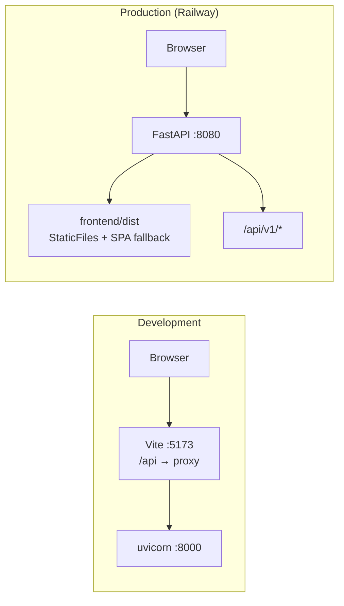

# Feature Design

## Overview

A React application at `frontend/`, in this repository, served from the **same origin** as the
API. Sign in, a shell, and the seven reports.

The shape of it:

- **One origin, not two.** The API's session cookie is `HttpOnly; SameSite=Lax`, so a browser
  will not send it on a cross-origin request. No amount of CORS changes that. So Vite proxies
  `/api` to the API in development, and in production the API serves the built assets. This
  needs no backend change, adds no CORS, and leaves the cookie's protections intact
  (`R1.AC7`, `R10.AC3`, `C3`).
- **One repository.** The generated client has to fail the build when it drifts from the API
  (`R10.AC2`), and that check only exists if the schema and the client are in one CI run.
- **Amounts are strings, and stay strings.** Every money field in the OpenAPI schema is
  `type: string` — a serialised `Decimal`. The formatter groups the digits of that string and
  never calls `Number()`, so `R4.AC2` and `R10.AC6` are satisfied by construction rather than
  by discipline. A `number` cannot hold `11500.000000` and give it back.
- **The URL is the state.** The screen, the company and the period live in the address, so
  `R2.AC5` (bookmark and share) and `R2.AC6` (back) are the same mechanism rather than two.
- **Charts are hand-drawn SVG.** Two charts, each a pure function of the table's own figures.
- **Reports are lazily loaded**, which is what keeps the initial bundle inside `NFR2` while
  using Ant Design.

## Serving one origin



In development the browser only ever sees `http://localhost:5173`, which is already the API's
default `public_base_url`. In production the API mounts the built assets at `/` and keeps its
routes at `/api/v1`, with any unknown path falling back to `index.html` so the router owns
client-side addresses.

**The alternative considered** was a static host (Cloudflare Pages) proxying `/api/*` to
Railway. It gives a CDN for assets and decouples the deploys, and it remains available later —
the browser still sees one origin either way. It is not chosen now because it adds a second
platform and a second deploy for a demo-stage system, and because the Alibaba Cloud move
(decision D10) will introduce a reverse proxy anyway, which is the same shape.

## Architecture

```
frontend/
  src/
    api/          generated schema types, the fetch client, query hooks
    app/          router, providers, error boundary
    shell/        layout, navigation, company switcher, language switcher
    money/        amount and date formatting — pure, string-based
    periods/      the period control and its URL encoding
    charts/       bar and line, hand-drawn SVG
    reports/      one folder per report screen
    i18n/         en.json, ar.json, setup
  tests/          component tests, axe checks, key-parity
```

**Module rules:** `reports/*` may import from `api`, `money`, `charts`, `periods` and `shell`;
nothing imports from `reports`. `money` and `charts` import nothing of ours — they are pure.

## Options Considered

### Option A — Monorepo, same-origin, generated types with a tiny typed fetch (chosen)

- Summary: `frontend/` beside `backend/`; `openapi-typescript` generates types from the API's
  own schema; `openapi-fetch` (about 1 KB) applies them to `fetch`; TanStack Query holds server
  state; the period lives in the URL.
- Why chosen: the client cannot disagree with the API without failing CI, the cookie needs no
  weakening, and there is no generated-code layer to read past. `openapi-fetch` types the path,
  the query string and the response from the same schema, so a renamed field is a type error in
  the screen that reads it.

### Option B — A separate frontend repository

- Summary: its own repository, its own CI, deployed to a static host.
- Why rejected: the generated client would drift silently between two repositories, because the
  freshness check needs the API's schema and the client together. It also doubles the CI setup
  and the secrets, and adds cross-repository version coordination, to gain a separation this
  project has no use for yet.

### Option C — A generated client library (openapi-typescript-codegen or similar)

- Summary: generate a function per endpoint and call those.
- Why rejected: thousands of generated lines to review and diff, a second opinion about how to
  cache and retry, and no better type safety than typed `fetch` over the same schema.

### Sub-decisions

| Question | Choice | Why |
|---|---|---|
| Money formatting | A **string** formatter: group the integer part, keep the fraction verbatim | `Number("11500.000000")` loses the scale the ledger chose, and floats are forbidden (`R4.AC2`, `R10.AC6`) |
| Charts | Hand-drawn SVG, two components | A charting library is 100 KB or more against a 400 KB budget, and would still need right-to-left work by hand. Two charts are about 150 lines, pure, and testable without a browser |
| Router | React Router, with the period in `searchParams` | One mechanism serves bookmarking, sharing and the back control |
| Server state | TanStack Query, keyed by `[report, companyId, period]` | Company change evicts by key prefix (`R10.AC5`); a stale report is never shown for the wrong company |
| Tests | Vitest with Testing Library and MSW, plus `axe` | MSW mocks are typed from the same schema, so a mock cannot drift from the API either |
| End-to-end | Playwright deferred to the first feature with forms | A browser run needs the API, migrations and a seeded company; on a read-only feature it would add CI time and flakiness for little more assurance than typed mocks plus the backend's own API tests |
| Arabic numerals | Western digits (`1,234.56`) in both languages | Saudi accounting and ZATCA documents use Western digits; Arabic-Indic digits would look local and read wrong on a tax invoice |
| Zero | A dash | `R4.AC7` — a 51-account trial balance is mostly zeros, and the eye needs the figures that matter |
| Bundle budget | A script that fails the build over 400 KB compressed | `NFR2` is otherwise a wish |

## Simplicity And Elegance Review

- Simplest viable shape: one package, no generated-code directory, no charting library, no
  state manager beyond TanStack Query, and the URL as the only place a period is remembered.
- Challenge applied to the first draft: a `ReportLayout` abstraction meant to serve all seven
  screens was cut — the trial balance, an ageing and a VAT return have genuinely different
  shapes, and forcing one frame on them produced props nobody could name. What they actually
  share is a header, a period control and a table style, which are three small components.
- Also cut: a Redux-shaped store, a `useCompany` context that duplicated the URL, and an
  `amountToNumber` helper that existed only to make charts easier (the charts now scale from
  strings).
- Coupling check: `money` and `charts` are pure and import nothing of ours. Report screens
  import the client and those two. Nothing imports a report screen.
- Future-proofing deferred: export buttons (D13), the write screens, dashboards, dark mode,
  Hijri dates, offline.

## Components And Interfaces

### `api/` — the client

- `schema.d.ts` — generated by `openapi-typescript` from the API's schema; committed.
- `client.ts` — `createClient<paths>({ baseUrl: "/api/v1", credentials: "same-origin" })`, plus
  a response interceptor that turns a 401 into a sign-out (`R1.AC6`) and a problem-details body
  into a typed `ApiError` carrying `code`, `title` and `detail` (`R9.AC1`, `R9.AC2`).
- `queries.ts` — one hook per report, each keyed `[name, companyId, period]`.
- `scripts/generate-client.mjs` — dumps `app.main.app.openapi()` and regenerates `schema.d.ts`;
  CI runs it and fails on any diff (`R10.AC2`).
- Requirements: `R10`, `R1.AC6`, `R9`

### `money/` — formatting, pure and string-based

- `formatAmount(value: string, currency: string, places?: number): string` — groups the integer
  part, keeps the fraction as given, renders zero as `—`, and marks negatives with a leading
  minus and a `negative` class rather than parentheses (`R4`).
- `formatDate(iso: string, locale: Locale): string` — a form whose day and month cannot be
  confused (`R4.AC6`).
- No `Number()`, no arithmetic, no `Intl.NumberFormat` on the amount itself — `Intl` would need
  a `number` to take.
- Requirements: `R4`, `R10.AC6`

### `shell/` — the frame

- `AppShell` — navigation, the signed-in person, the company being viewed (`R2.AC1`).
- `CompanySwitcher` — from `/auth/me`; hidden with one company, and a plain message with none
  (`R2.AC2`, `R2.AC7`).
- `LanguageSwitcher` — sets the language, the document `dir` and `lang`, and remembers the
  choice; keeps the screen and period (`R3`).
- Requirements: `R2`, `R3`

### `periods/` — choosing what a report covers

- `PeriodControl` — named periods, an explicit range, or a single date for as-of reports;
  refuses an end before a start without touching the report (`R6.AC3`).
- `usePeriod()` — reads and writes the period in `searchParams`, so it survives navigation,
  sharing and the back control (`R2.AC5`, `R2.AC6`, `R6.AC4`).
- Requirements: `R6`, `R2.AC5`, `R2.AC6`

### `charts/` — two charts, drawn to the scale

- `BarChart` — the ageing buckets (`R7.AC2`).
- `LineChart` — income and expenses by month (`R7.AC1`).
- Both: scale from the string amounts, label every axis with the currency, mirror under
  right-to-left, render a `<title>`/`<desc>` and a visually hidden table as the text
  alternative (`R7.AC3`, `R7.AC5`, `R11.AC4`), and return the figures without a chart when
  there are fewer than three points (`R7.AC6`).
- Requirements: `R7`, `R11.AC4`

### `reports/` — seven screens

Each lazily loaded, each rendering the report's own shape: `TrialBalance`, `ProfitAndLoss`,
`BalanceSheet`, `CashFlow`, `AgedReceivables`, `AgedPayables`, `VatReturn`, and
`AccountDetail` for the drill-down.

Shared pieces: `ReportHeader` (company, period, currency, read-at), `AmountCell`, and
`HierarchyTable` (nested rows, collapsible groups, subtotals).

Every account figure is a link to `AccountDetail` for the same period, and returning restores
the reading position (`R8`).

- Requirements: `R5`, `R8`

### `app/` — the frame around the frame

- `router.tsx` — routes, lazy boundaries, and a redirect that remembers where someone was
  going before they signed in (`R1.AC9`).
- `providers.tsx` — query client, i18n, Ant Design config (direction, locale).
- `ErrorBoundary` — an unrecognised failure becomes words and a retry, never a stack trace
  (`R9.AC3`, `R9.AC6`).
- Requirements: `R1`, `R9`

### Backend: two small additions

- `app/main.py` mounts `frontend/dist` when it exists, with an SPA fallback, so production is
  one origin. Absent in development, where Vite serves the assets — so nothing changes for
  anyone running the API alone.
- `scripts/openapi.py` dumps the schema for the client generator.
- No route, model or permission changes. The reports API is used exactly as delivered.

## Data Models

No database work. The shapes the browser holds:

| Shape | Where it comes from | Notes |
|---|---|---|
| `paths` / `components` | generated from the API's OpenAPI schema | The only definition of a response; screens read `components["schemas"]["TrialBalanceOut"]` and cannot invent a field |
| `Period` | the URL's `searchParams` | `{ named }` or `{ start, end }` or `{ on }`; encoded exactly as the API's query parameters, so there is no second vocabulary |
| `Locale` | `"en" \| "ar"` | Drives i18n, `dir` and Ant Design's locale together |
| `ApiError` | a problem-details response | `{ status, code, title, detail }`, thrown by the client and rendered by `R9` |

Nothing financial is written to `localStorage`; the only thing remembered is the chosen
language (`NFR6`, `R3.AC7`).

## Error Handling

| Condition | What a person sees | Criterion |
|---|---|---|
| 401 on any request | Returned to sign-in, with where they were going kept | `R1.AC6`, `R1.AC9` |
| 403 | "You do not have permission to read the reports for this company" | `R9.AC1` |
| 422 with a `reporting.*` code | The API's message against the period control that caused it | `R9.AC2`, `R6.AC3` |
| 404 on account detail | "That account no longer exists", with a way back to the report | `R9.AC2` |
| 5xx or an unparseable body | "Something went wrong reading this report", and a retry | `R9.AC3` |
| `fetch` rejects | "Cannot reach the server — check your connection", worded differently from a refusal | `R9.AC4` |
| Any retry | The previous figures stay on screen | `R9.AC5` |

## Security Considerations

- The session stays in the API's `HttpOnly` cookie. The application never reads it, never
  copies it, and stores nothing in its place (`R1.AC7`, `R1.AC8`).
- Same-origin means the cookie is sent without `SameSite=None`, so the cross-site protection
  the backend relies on is unchanged.
- No financial figure is persisted in the browser, so signing out on a shared machine leaves
  nothing behind (`NFR6`).
- Every screen renders text as text; nothing from the API is injected as HTML.
- The company in the URL is a request parameter, not a grant: the API decides, and a 403 is
  rendered as one.

## Failure Modes And Tradeoffs

- Failure mode: the generated client drifts from the API and a screen reads a field that no
  longer exists.
  - Mitigation: CI regenerates `schema.d.ts` and fails on any diff (`R10.AC2`), so the drift is
    a red build rather than a blank column.
- Failure mode: a figure is re-rounded in the browser and the screen disagrees with the ledger.
  - Mitigation: amounts are strings from end to end and the formatter cannot do arithmetic. A
    test asserts a six-decimal amount survives formatting with its scale intact.
- Failure mode: Ant Design's weight pushes the first load past the budget.
  - Mitigation: report screens are lazily loaded and a size check fails the build over 400 KB
    compressed.
  - Tradeoff: the first report costs an extra request. Worth it to keep the shell light.
- Failure mode: right-to-left mirrors a table of figures and the numbers reverse.
  - Mitigation: numeric cells are `dir="ltr"` inside the mirrored layout, and a test renders
    the trial balance in Arabic and asserts the amounts read unchanged (`R3.AC5`).
- Failure mode: a chart and its table disagree because the chart aggregated separately.
  - Mitigation: both take the same array; the chart does no arithmetic beyond scaling to pixels
    (`R7.AC4`).
- Tradeoff: hand-drawn charts mean writing axes and ticks. Accepted for two charts, a 100 KB
  saving, and control over direction and the text alternative. A third chart type would be the
  moment to reconsider.
- Tradeoff: no end-to-end browser test in this feature. The backend's own API tests cover the
  endpoints, and typed mocks cover the screens; the gap is the wiring between them, which the
  first write feature will close with Playwright.

## Testing Strategy

| Layer | Location | What it proves |
|---|---|---|
| Money | `tests/money.test.ts` | Grouping, scale preserved, zero as a dash, negatives, and that no amount passes through `Number` |
| Periods | `tests/periods.test.ts` | URL encoding and decoding, named periods, an end before a start refused |
| Charts | `tests/charts.test.tsx` | Scale and labels from string amounts, the text alternative, too few points, mirrored layout |
| Screens | `tests/reports/*.test.tsx` | Each report renders its figures from a typed mock: hierarchy, subtotals, collapsing, drill-down links, empty and loading states |
| Shell | `tests/shell.test.tsx` | Sign-in, sign-out, 401 redirect, company switch evicting the cache, language switch keeping screen and period |
| Language | `tests/i18n.test.ts` | Every key exists in both catalogues, and no screen renders a raw key (`R3.AC8`) |
| Accessibility | `tests/a11y.test.tsx` | `axe` finds no violation on every screen; keyboard reaches every control; inputs have labels (`R11`, `NFR3`) |
| Types | `tsc --noEmit` | Strict mode, no `any` in application code (`NFR4`) |
| Freshness | `npm run check:client` | `schema.d.ts` matches the API's schema (`R10.AC2`) |
| Size | `npm run check:size` | Initial bundle within budget (`NFR2`) |

## Verification Plan

- Requirement proof: every acceptance criterion maps to a named test; tasks carry the command.
- Test evidence: `tsc --noEmit`, `eslint`, `vitest --maxWorkers=2`, the client freshness check,
  the size check, and a production build.
- CI: a new `frontend` job on Node 22 running all of the above, alongside the existing backend
  jobs, and both must pass before merge.
- Operational evidence: the built application served by the API on one origin, signing in
  against the demo company and reading all seven reports.

## Requirement Coverage

| Requirement | Covered By |
| --- | --- |
| `R1` | `app/router`, `api/client` 401 handling, `shell` sign-in and sign-out; shell tests |
| `R2` | `shell/AppShell`, `CompanySwitcher`, the router and `searchParams`; shell tests |
| `R3` | `i18n`, `LanguageSwitcher`, Ant Design direction; i18n and screen tests |
| `R4` | `money/`; money tests |
| `R5` | `reports/*`, `ReportHeader`, `HierarchyTable`; screen tests |
| `R6` | `periods/`; period tests |
| `R7` | `charts/`; chart tests |
| `R8` | `reports/AccountDetail` and the figure links; screen tests |
| `R9` | `api/client` `ApiError`, `ErrorBoundary`, per-screen error states; screen tests |
| `R10` | `api/schema.d.ts`, `openapi-fetch`, the freshness check; `tsc` and CI |
| `R11` | Semantic markup, focus styles, chart alternatives; `axe` and keyboard tests |
| `NFR1` | Lazy report screens, one request per report; the size check as its proxy |
| `NFR2` | `check:size` in CI |
| `NFR3` | `axe` on every screen |
| `NFR4` | `tsc --noEmit` in strict mode, `eslint` forbidding `any` |
| `NFR5` | Responsive layout; a narrow-viewport render test |
| `NFR6` | Nothing financial in storage; a test asserting storage holds only the language |
