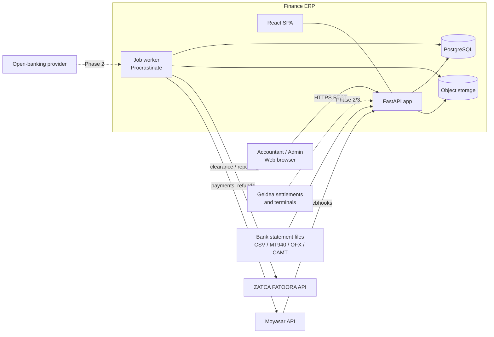
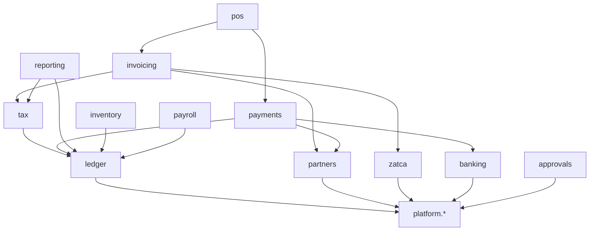
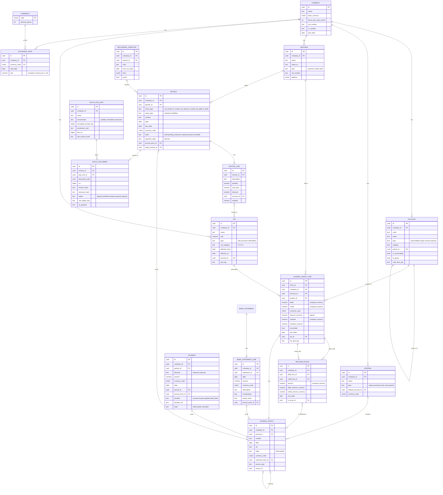
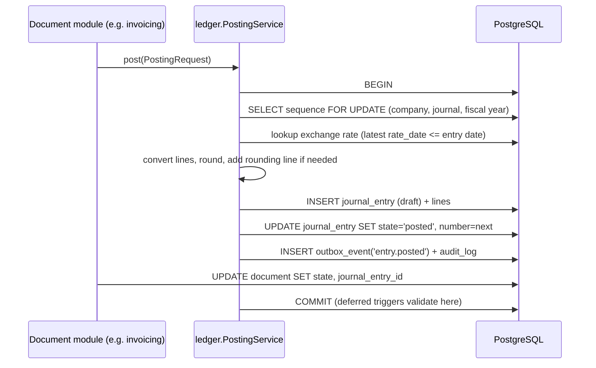
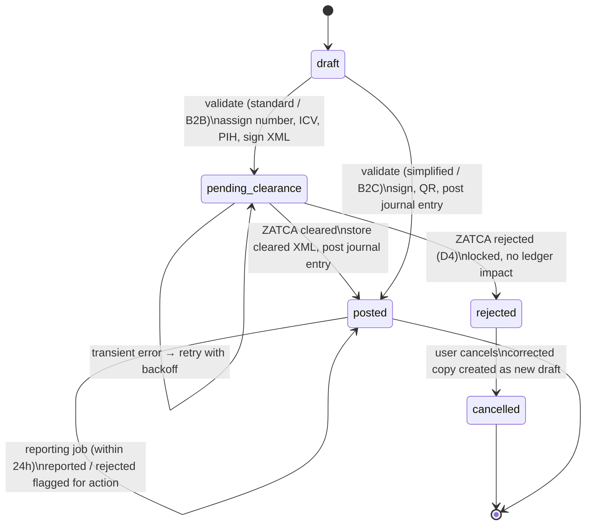

# Finance ERP — Architecture

Status: **All decisions D1–D12 made; Phase 1 build in progress** · Scope: Phase 1 in detail, Phases 2–4 as boundaries and
extension points · Source brief: [`../finance-erp-mvp-prompt.md`](../finance-erp-mvp-prompt.md)

Decision log: see §14. Dependencies in §2 approved.

---

## 1. Guiding principles

1. **The ledger is the only source of truth.** Every document that affects the books
   produces exactly one journal entry through one posting service. Reports read posted
   journal lines only.
2. **Invariants live in the database.** Balance, immutability, company isolation and
   reconciliation limits are enforced by PostgreSQL constraints and triggers, so a bug
   or a direct SQL write cannot corrupt the books. Application checks exist for good
   error messages, not for safety.
3. **Modular monolith.** One deployable backend, one database, strict internal module
   boundaries enforced in CI. No microservices — a ledger needs single-database ACID
   transactions across modules.
4. **Build the seams for later phases now.** Permissions, approvals, custom fields and
   multi-device ZATCA signing are designed in Phase 1 even where their UI comes later.
5. **Statutory rules are data.** VAT, withholding, GOSI and EOSB rates are
   effective-dated configuration, never constants in code.

---

## 2. Tech stack (confirmed — D1)

| Layer | Choice | Why |
|---|---|---|
| Language (backend) | **Python 3.13** | Native `Decimal`; mature crypto and XML libraries for ZATCA; strong reporting/data tooling. |
| Web framework | **FastAPI** | Typed request/response models, OpenAPI generated from code, dependency injection for auth/permission/company context. |
| Validation / DTOs | **Pydantic v2** | Comes with FastAPI; `Decimal` serialized as strings in JSON. |
| ORM + migrations | **SQLAlchemy 2.0 (sync sessions, psycopg 3) + Alembic** | Best-in-class transaction and locking control (`with_for_update`, savepoints), easy raw-SQL migrations for triggers, Core API for reports and dynamic custom models. Sync sessions keep transaction code simple. |
| Database | **PostgreSQL 18 on Neon** (D12) | `NUMERIC`, deferred constraint triggers, row-level security, JSONB, `SKIP LOCKED` queues. Neon branches give every developer and test run its own database without a local Postgres. See §17.2. |
| Background jobs | **Procrastinate** (Postgres-backed) fed by a **transactional outbox** | No Redis; jobs are enqueued in the same transaction as the posting that caused them (ZATCA submission, webhooks, automations). Periodic tasks cover recurring billing. |
| ZATCA crypto / XML | `cryptography` (ECDSA secp256k1, CSR), `lxml` (UBL 2.1, canonicalization), `signxml` or hand-built XAdES signature | Validated against **ZATCA's official SDK validator run in CI** — language libraries are not trusted until the SDK accepts the output. |
| Object storage | S3-compatible bucket (hosted, also for development) | Immutable archive of signed/cleared ZATCA XML, bank statement files, attachments. |
| Frontend | **React + TypeScript + Vite** | As briefed. |
| UI kit | **Ant Design** | Dense data tables and forms suited to ERP screens; built-in RTL and Arabic locale. |
| Frontend data | TanStack Query + OpenAPI-generated TS client; `decimal.js` for money in the browser | Server stays authoritative for all totals. |
| i18n | `react-i18next` (UI), Babel/gettext-style catalogs (server messages, PDFs) | Arabic + English, RTL layout switch. |
| PDF invoices | WeasyPrint (HTML → PDF) | Arabic shaping + RTL, embeds ZATCA QR. |
| API style | **REST + OpenAPI 3.1** | See §9. |
| Auth (Phase 1) | First-party sessions (HTTP-only cookie), Argon2id password hashes | OIDC/SSO can be added in Phase 2 without changing the permission layer. |
| Testing | pytest (+ `pytest-xdist -n 2`), Hypothesis (property tests), real Postgres on short-lived Neon branches; Vitest (`--maxWorkers=2`) + Playwright | Ledger invariants need a real database, never mocks. |
| Module boundaries | `import-linter` contracts in CI | Stops modules reaching into each other's internals. |
| Local dev / deploy | **No local database or storage services.** Code runs locally (or on Railway) against a personal Neon branch and a hosted bucket; container images deployed to Railway now, Alibaba Cloud later | See §17. |
| Observability | OpenTelemetry traces + structured JSON logs; Sentry for errors | |

**Alternative considered: NestJS + TypeScript** (one language end to end). Rejected as
the default because money needs a decimal library everywhere (`pg` returns `NUMERIC` as
strings, arithmetic mistakes are easy), and the ZATCA canonicalization/signing ecosystem
is thinner. If your team is TypeScript-only, NestJS + TypeORM + pg-boss is a viable swap
and the rest of this document still applies unchanged.

**Approved dependencies (added to the project as each module needs them):** Procrastinate, hosted S3-compatible bucket, WeasyPrint,
Ant Design, signxml (or custom signer), ZATCA SDK (CI only), Sentry, `neonctl` (branch
management in scripts and CI).

---

## 3. System context



---

## 4. Module map and boundaries

### 4.1 Modules by phase

| Module | Phase | Owns |
|---|---|---|
| `platform.tenancy` | 1 | companies, branches, company settings, lock dates |
| `platform.identity` | 1 | users, sessions, password auth |
| `platform.access` | 1 (model) / 2 (full) | roles, permissions, record rules, RLS policies |
| `platform.audit` | 1 | append-only audit log |
| `platform.sequence` | 1 | gapless document numbering |
| `platform.jobs` | 1 | outbox, job definitions, schedules |
| `platform.files` | 1 | attachments, immutable archives |
| `platform.extension` | 1 (fields) / 3 (Studio) | field/model metadata, `x_data` storage, automations |
| `ledger` | 1 | currencies, rates, accounts, journals, entries, lines, posting, reversal |
| `partners` | 1 | customers, vendors, addresses, VAT/CR numbers |
| `tax` | 1 | tax definitions, VAT categories, tax computation, VAT return grid tags |
| `invoicing` | 1 | invoices, bills, credit/debit notes, recurring templates |
| `zatca` | 1 | EGS units, keys/CSIDs, XML, signing, QR, hash chain, submissions |
| `banking` | 1 | bank accounts, statements, import parsers, bank-feed adapters (2) |
| `payments` | 1 | payments, reconciliation, FX difference entries, provider adapters (2) |

`banking` and `payments` are built as one Python package, **`app.treasury`**, because they
share the open-amount machinery: a statement line is reconciled to a payment, and both close
the same ledger lines. Inside it, `statements` parses bank files with no database at all,
`reconciling` imports and reconciles them, `payments` records and posts, `matching` settles
open items and `exchange` works out realised differences. The provider adapters of Phase 2
(Moyasar, Geidea, bank feeds) will call `match_lines` and `reconcile_line` rather than
replace them.
| `reporting` | 1 | financial reports, VAT return, dashboards (2), Zakat (2) |
| `approvals` | 2 | approval rules, requests, steps |
| `inventory` | 2 | products, locations, stock moves, valuation layers |
| `pos` | 3 (online) / 4 (offline) | registers, sessions, orders, terminals |
| `payroll` | 3 | employees, contracts, salary rules, payslips, GOSI, EOSB, WPS |

### 4.2 Dependency rules



- Each module exposes a **public service API** (`<module>/api.py`) and **events** it
  publishes. Everything else is private. `import-linter` fails CI on violations.
- **Only `ledger.PostingService` creates or changes journal entries.** Invoicing, payments,
  inventory, POS and payroll build a `PostingRequest` and hand it over.
- `reporting` only reads. It has no write access to any table.
- Modules never share tables. Cross-module references are foreign keys to IDs, never joins
  into another module's private tables outside `reporting`.
- Approvals and automations hook into document state machines through events and guard
  interfaces, so core modules don't import them.

---

## 5. Data model (Phase 1)

### 5.1 Conventions

- Every business table has `company_id NOT NULL`, `created_at`, `created_by`, `updated_at`,
  `updated_by`, and `x_data JSONB NOT NULL DEFAULT '{}'` where extensible (§11).
- IDs are `UUID v7` (sortable, safe to generate offline in POS later).
- **Money:** `NUMERIC(20,6)` columns; values must already be rounded to the currency's
  `decimal_places` (enforced by trigger on ledger lines). Quantities and unit prices use
  `NUMERIC(20,6)` with no rounding requirement.
- **Cross-company safety:** referenced tables carry `UNIQUE (id, company_id)` and
  referencing tables use **composite foreign keys** `(x_id, company_id)`, so a line can
  never point at another company's account, partner, tax or journal.
- Enum-like columns use `TEXT` + `CHECK` constraints (easier migrations than PG enums).

### 5.2 Entity-relationship diagram



Supporting Phase 1 tables not drawn: `branch`, `app_user`, `role`, `permission`,
`user_company_role`, `sequence`, `audit_log`, `attachment`, `outbox_event`,
`field_definition`, `bank_statement`, `bank_import_profile`, `payment_terminal`
(TID/MID registry, populated now, used in Phase 2), `tax_grid` (VAT return boxes).

### 5.3 Notes on the model vs the brief

- `reconciled_flag` from the brief is kept as `reconciled`, plus `residual` /
  `residual_currency`. These are the **only mutable columns on a posted line**, maintained
  by the reconciliation service and checked against the `reconciliation` table by trigger.
- The brief's invoice states `paid/partial` became a **derived `payment_state`**
  (`not_paid / partial / paid / reversed`), computed from line residuals so it cannot
  drift from the ledger.
- `pending_clearance` and `rejected` were added for ZATCA standard invoices (§8.2, D4).
- Credit/debit notes are invoice `move_type`s linked to their origin by `origin_invoice_id`.
- Exchange rates are company-scoped because "rate to base currency" depends on the
  company's base currency.

---

## 6. Ledger engine

### 6.1 Database-enforced invariants

| Invariant | Mechanism |
|---|---|
| Line is one-sided and non-negative | `CHECK (debit >= 0 AND credit >= 0 AND (debit = 0 OR credit = 0))` |
| Amounts rounded to currency precision | `BEFORE INSERT/UPDATE` trigger on `journal_entry_line` comparing to `round(x, currency.decimal_places)` |
| Posted entry balances in company currency | `CONSTRAINT TRIGGER ... DEFERRABLE INITIALLY DEFERRED` on lines and on entry state change: `SUM(debit) = SUM(credit)` and at least one non-zero line |
| Posted entry balances in transaction currency when single-currency | Same deferred trigger: if all lines share one currency ≠ company currency, `SUM(amount_currency) = 0` |
| Posted entries are immutable | `BEFORE UPDATE/DELETE` triggers on entry and lines raise if the entry is posted; only `reconciled`, `residual`, `residual_currency` may change on lines, and entry→`reversed_entry` links may be set |
| `posted → draft` is impossible | Trigger rejects any state change except `draft → posted` |
| Lock dates respected | Posting trigger rejects `date <= company.lock_date_*` |
| Account belongs to the same company | Composite FK `(account_id, company_id)` |
| Group accounts can't be posted to | Trigger rejects lines on `is_group = true` accounts |
| Reconciliation can't exceed open amounts | Deferred trigger: for each line, `SUM(reconciliation.amount) <= line amount` and residual equals amount minus matched sum |

The application database role has no `TRUNCATE`, and no `UPDATE/DELETE` privileges on
`audit_log`.

### 6.2 Posting flow



- **Isolation:** `READ COMMITTED` with explicit row locks. Posting to the same journal is
  serialized by the sequence row lock, which is also what makes numbering gapless. Different
  journals post in parallel.
- **Deadlock avoidance:** locks are always taken in a fixed order (sequence → documents by
  id → ledger lines by id).
- **Reversal:** `PostingService.reverse(entry_id, date, reason)` creates a new posted entry
  with debits/credits swapped, links both ways, and unreconciles/reconciles the pair so the
  original's open amounts close out.
- **Rate lookup:** a missing rate is an error, never a silent default of 1. SAR is pegged to
  USD but is still stored as an ordinary rate.

### 6.3 Chart of accounts

- `type` (5 values from the brief) drives the P&L/Balance Sheet split; `subtype` drives
  report sections and behaviour: `bank_cash`, `receivable`, `payable`, `current_asset`,
  `non_current_asset`, `prepayment`, `current_liability`, `non_current_liability`,
  `equity`, `current_year_earnings`, `income`, `other_income`, `cost_of_revenue`,
  `expense`, `depreciation`.
- `receivable` and `payable` accounts are forced `is_reconcilable = true`.
- Parent/child hierarchy for grouping; postings only to leaf accounts.
- A **Saudi chart of accounts template** (bilingual names, VAT input/output accounts,
  withholding tax payable, Zakat provision, EOSB provision, GOSI payable) is loaded when a
  company is created, then fully editable.
- Default accounts per company live in `company_setting` (receivable, payable, FX gain,
  FX loss, rounding, outstanding receipts/payments, suspense).

---

## 7. Tax engine

- `TaxService.compute(lines, partner, date, price_includes_tax)` is a **pure function**
  returning per-line base, tax per tax, and grouped tax lines. The same function feeds the
  invoice screen preview, the posting request and the ZATCA XML, so they can never disagree.
- Taxes are picked by effective date (`effective_from <= invoice date < effective_to`).
- Each tax line carries `tax_id` and `tax_grid_tag`; the **VAT return** is a `GROUP BY
  tax_grid_tag` over posted lines for the period.
- VAT categories follow ZATCA codes: `S` standard, `Z` zero-rated, `E` exempt, `O` out of
  scope, each exemption reason stored on the tax for XML output.
- **Withholding tax** is modelled as a `withholding` tax type applied on vendor payments to
  non-residents, posting to WHT payable, with rates per payment category as configuration.
- Rounding mode and inclusive/exclusive pricing are open decisions (§14).

---

## 8. Invoicing and ZATCA

### 8.1 Invoicing

- Documents: customer invoice, vendor bill, credit note, debit note.
- Posting builds: receivable/payable line(s) per due-date instalment, income/expense lines
  per invoice line, tax lines per tax. Vendor bills don't go to ZATCA.
- **Recurring billing:** a periodic job runs daily, finds templates with
  `next_run_date <= today` using `FOR UPDATE SKIP LOCKED`, creates **draft** invoices,
  advances `next_run_date` in the same transaction (idempotent if the job re-runs).
- Cancelling a posted invoice = posting a reversal (and for ZATCA-issued invoices, issuing
  a credit note — §8.2).

### 8.2 ZATCA e-invoicing

**EGS units.** Each issuing "device" (initially one per company/branch; later each POS
register) is a `zatca_egs_unit` with its own key pair, CSR, compliance CSID, production CSID,
invoice counter (ICV) and previous-invoice hash (PIH). Private keys are encrypted at rest
with an envelope key held outside the database (KMS or mounted secret).

**Onboarding:** generate key + CSR → request compliance CSID with OTP from the FATOORA
portal → run the required compliance invoice checks → request production CSID. All steps
are UI-driven wizards with state stored per unit.

**Issuing flow:**



- Signing per EGS unit is **serialized** (`SELECT ... FOR UPDATE` on the unit row) because
  ICV and PIH form a chain.
- Generated XML (and the cleared XML returned by ZATCA) is written to object storage with
  its SHA-256 recorded in `zatca_document`; stored objects are never overwritten.
- Submission runs through the outbox → job queue with exponential backoff; every request and
  response is logged for audit.
- Invoice PDFs are bilingual (Arabic required), include the QR code, and are rendered from
  the stored XML values rather than recomputed.
- **Validation oracle:** CI runs the ZATCA SDK validator against a corpus of generated
  invoices (standard, simplified, credit, debit, zero-rated, exempt, multi-currency).

---

## 9. API design

**REST + OpenAPI 3.1.** Chosen over GraphQL because FastAPI generates the contract from
code, the frontend client is generated from it, webhooks and third-party integrations are
REST anyway, and per-endpoint permission checks, caching and audit are simpler to reason
about.

- Company-scoped paths: `/api/v1/companies/{company_id}/invoices/{id}`.
- State transitions are explicit action endpoints, never `PATCH state`:
  `POST .../invoices/{id}/validate`, `.../post`, `.../reverse`, `.../cancel`.
- Posted resources reject `PATCH/PUT/DELETE` with `409 Conflict`.
- `Idempotency-Key` header required on all posting, payment and import endpoints; stored with
  the response for 24h.
- Money in JSON is a string (`"1150.00"`) with an explicit `currency` field.
- Errors use RFC 9457 problem details with stable error codes (e.g. `ledger.unbalanced`,
  `ledger.period_locked`, `zatca.rejected`).
- Lists: cursor pagination, filter/sort query params, `?fields=` for custom `x_` fields.
- Webhooks: `/api/v1/webhooks/{provider}` — authenticity verified, then the payment is
  re-fetched from the provider API before anything is recorded; unique
  `(provider, provider_ref)` makes processing idempotent.

---

## 10. Payments, banking and reconciliation

### 10.1 Accounting pattern

```
Customer pays invoice (manual payment or Moyasar):
  Dr Outstanding Receipts (or Moyasar Clearing)   Cr Accounts Receivable   ← payment entry
Bank statement line arrives and is matched:
  Dr Bank                                          Cr Outstanding Receipts  ← statement entry
Provider fees (Phase 2):
  Dr Bank Charges                                  Cr Moyasar Clearing
```

Receivable/payable lines of the payment are reconciled against the invoice's lines. The
outstanding/clearing accounts are reconciled against bank statement entries. If an invoice
has no separate payment record, a statement line can be matched directly to the receivable.

### 10.2 Reconciliation service

- `reconcile(line_ids)` locks all lines `FOR UPDATE` in id order, pairs debits with credits
  (oldest first), writes `reconciliation` rows for matched amounts, updates residuals, and
  sets `reconciled = true` when residual reaches zero in both company and transaction currency.
- **Realized FX difference:** when matched transaction-currency amounts close a line but
  company-currency amounts differ, it posts an FX gain/loss entry and links it to the
  reconciliation.
- `unreconcile(reconciliation_ids)` deletes the rows, restores residuals and reverses any FX
  difference entry.
- Invoice `payment_state` is recalculated from its receivable/payable residuals after every
  reconcile/unreconcile.

### 10.3 Bank statements

- `BankStatementSource` interface with implementations: `CsvImport` (column-mapping profile
  per bank), `Mt940Import`, `OfxImport`, `Camt053Import`; `OpenBankingFeed` in Phase 2.
- Deduplication: `import_hash` = hash(account, date, amount, reference, running balance),
  unique per bank account.
- Matching suggestions rank candidates by amount, partner, reference/invoice number in the
  description, and date proximity. The user confirms; rules for auto-matching come later.

### 10.4 Provider adapters (Phase 2+)

- **Moyasar:** payment links on invoices, webhook → verified fetch → payment posted to
  Moyasar Clearing → reconciled to invoice; refunds via API create outbound payments;
  settlement reports post fees and transfer to bank.
- **Geidea:** `payment_terminal` registry keyed by **TID + MID** per branch; settlement files
  import terminal transactions, which match to POS sessions (Phase 3) and bank deposits,
  with fees posted per settlement. The terminal integration method (ECR vs cloud API) is to
  be confirmed with Geidea.
- **Open banking:** provider chosen in Phase 2 after evaluating SAMA-licensed options.

---

## 11. Access control, approvals and extensibility

### 11.1 Access control

- **Phase 1:** `app_user` ↔ `user_company_role` ↔ `role` ↔ `permission` (`resource:action`,
  e.g. `invoice:post`). Only an Admin role ships, but **every endpoint declares its required
  permission** through a FastAPI dependency, and every query is filtered by the caller's
  allowed companies.
- **Phase 2:** more roles (accountant, AP clerk, cashier, auditor…), record rules
  (branch/owner predicates compiled into SQLAlchemy filters), field-level read/write
  restrictions, and **PostgreSQL row-level security** on `company_id` as defense in depth
  (`SET LOCAL app.company_ids` per transaction).
- `audit_log` records who did what, before/after values for drafts, and every posting,
  reversal, reconciliation, login and permission change.

### 11.2 Approvals hook

Every document state machine calls `GuardRegistry.check(document, transition)` before a
transition. Phase 1 registers no guards. Phase 2's `approvals` module registers a guard that
blocks `validate/post` when a matching `approval_rule` (amount, document type, company) has
no completed `approval_request`, and adds a `to_approve` state.

### 11.3 Extension layer (Studio foundation)

- **Phase 1:** `field_definition` metadata (model, name `x_*`, type, label ar/en, required,
  selection options, filterable) + `x_data JSONB` on extensible tables. The API validates
  `x_data` against metadata; filterable fields get expression indexes. Custom fields are
  never allowed on ledger lines' financial columns and never affect posting.
- **Phase 3 — user-defined record types:** `model_definition` + `field_definition` +
  `view_definition` (list/form layout JSON rendered by a generic React form/list engine).
  Storage approach is open decision D7.
- **Phase 3 — automations:** `automation_rule` = trigger (on create / update / state change
  / schedule) + condition in a **sandboxed expression language (e.g. JSONLogic; no
  user-supplied code execution)** + ordered actions from a fixed catalogue (set field,
  create record, send email/notification, call webhook, request approval). Rules run in the
  job queue, act through public service APIs with the rule owner's permissions, have a
  recursion depth limit, and are fully audited. They cannot write journal entries directly.

---

## 12. Reporting

All reports are SQL over posted `journal_entry_line` joined to `journal_entry` (state
`posted`) and `account`. Company currency only; consolidation across companies with
different base currencies is out of scope for Phase 1.

| Report | Definition |
|---|---|
| Trial balance | Sum debit/credit per account for a date range + opening balance. The reference every other report is tested against. |
| P&L | Income/expense accounts over the period, grouped by subtype and hierarchy. |
| Balance Sheet | Asset/liability/equity balances as of a date; **current-year earnings and prior-year retained earnings computed from P&L accounts** (open decision D6 on closing entries). |
| Cash Flow | Movements on `bank_cash` accounts, classified by counterpart accounts' `cash_flow_tag` (operating/investing/financing); method is open decision D5. |
| Aged Receivables/Payables | Open amounts **as of a date**: line amount minus reconciliations with `max_date <= as_of`, bucketed by due date (current, 1–30, 31–60, 61–90, 90+). |
| VAT return | Grouped by `tax_grid_tag` for the filing period, matching ZATCA return boxes. |

**Reconciliation tests (required for each report):**
- P&L net result = change in current-year earnings on the Balance Sheet.
- Balance Sheet: assets = liabilities + equity (including computed earnings).
- Cash Flow: opening cash + net flows = closing `bank_cash` balance.
- Aged receivables total as of date D = receivable account balances at D.
- VAT return output/input tax = movements on VAT accounts for the period.
- Property test: Hypothesis generates random document sequences (invoices, payments, partial
  and FX reconciliations, reversals) and asserts all of the above plus trial balance = 0.

**Phase 2 dashboards** read from `ledger_daily_balance` (company, account, partner, date,
debit, credit), refreshed from posted lines via the outbox. It can be dropped and rebuilt at
any time, and a nightly job compares it with raw lines and alerts on any difference.

---

## 13. Later-phase architecture notes

- **Inventory (P2):** `stock_move` in done state creates valuation layers (FIFO layers or
  running average) and posts perpetual valuation entries (Inventory / GRNI / COGS) through
  `PostingService`. Vendor bills post against GRNI, with price differences to a variance
  account.
- **POS (P3 online, P4 offline):** register = branch + EGS unit + optional Geidea terminal
  (TID/MID). Orders create simplified ZATCA invoices; session close posts one summarized
  entry (sales by tax, payments by method, cash difference). **Offline (P4):** PWA with an
  IndexedDB order queue; each register is its own EGS unit so it can sign and generate QR
  codes locally, keeping its own ICV/PIH chain; client UUID v7 IDs make sync idempotent;
  simplified invoices are reported within 24h once back online.
- **Payroll (P3):** salary structures as ordered rule lists (configuration, not code);
  payslip computation is a pure function over contract + inputs + effective-dated rates;
  payslip batches post salary expense, GOSI employer/employee liabilities, EOSB accrual and
  net pay payable; WPS/Mudad export file generated per batch.
- **Inter-company (P4):** a posting in company A to an inter-company partner creates a
  mirrored draft in company B, linked both ways.

---

## 14. Decisions

| # | Decision | Recommendation |
|---|---|---|
| D1 | Backend stack | ✅ **Decided: Python/FastAPI** stack as in §2. |
| D2 | Tax rounding: per line vs per invoice total | ✅ **Decided:** **Per line**, 2 decimals, then sum — simplest to reconcile with ZATCA line-level XML amounts; confirm against ZATCA's calculation rules and the SDK validator. |
| D3 | Tax-inclusive vs tax-exclusive prices | ✅ **Decided:** Support both per price list; **exclusive default** for B2B, **inclusive** for POS/B2C. |
| D4 | ZATCA-rejected standard invoice | ✅ **Decided:** invoice is locked in `rejected`; the user cancels it and a corrected copy is created with a new number. No ledger impact because clearance happens before posting. Still to verify during the ZATCA spike: how ICV/PIH continue after a rejection. |
| D5 | Cash Flow method | ✅ **Decided:** **Direct method** from cash-account counterparts for Phase 1 (falls straight out of the ledger); indirect method as a Phase 2 view. |
| D6 | Year-end close | ✅ **Decided:** **No closing entries required** — retained earnings computed dynamically; optional closing entry available for users who want it. |
| D7 | Storage for user-defined record types | ✅ **Decided:** **JSONB** (`custom_record` table + GIN/expression indexes) first; generated real tables later only if performance needs it. |
| D8 | Rounding difference from converting multi-line foreign-currency entries | ✅ **Decided:** Post the difference to a **dedicated rounding account** rather than adjusting the largest line. |
| D9 | Unrealized FX revaluation at period end | ✅ **Decided:** Manual "revalue open foreign-currency items" action posting an auto-reversing entry — Phase 1 stretch, Phase 2 at the latest. |
| D10 | Hosting | ✅ **Decided:** **Railway** for development, demos and ZATCA sandbox work now; **Alibaba Cloud (Saudi region)** for production later. See §17. |
| D11 | Record retention | ✅ **Decided:** Keep ZATCA XML and ledger data for the statutory retention period (verify current VAT and Zakat retention rules); no hard deletes of posted data ever. |
| D12 | Database service (pre-production) | ✅ **Decided:** **Neon** Postgres, nothing database-related on the local machine. Production database moves to Alibaba ApsaraDB with the rest of the stack. See §17.2. |

---

## 15. Phase 1 testing strategy

- **Database invariant tests** that bypass the application and write raw SQL to prove the
  triggers reject: unbalanced posted entries, edits to posted lines, `posted → draft`,
  cross-company references, postings inside locked periods, over-reconciliation.
- **Concurrency tests** (real Postgres on a Neon test branch, direct connections, N threads × own connections):
  - Concurrent posting to one journal → all entries balanced, numbers gapless and unique.
  - Concurrent posting to different journals → no deadlocks, all succeed.
  - Two concurrent reconciliations against the same invoice line → never over-matched.
  - Concurrent ZATCA signing on one EGS unit → unbroken ICV/PIH chain.
- **Property tests** (Hypothesis) for tax computation, FX conversion and report reconciliation.
- **ZATCA SDK validation** of generated XML in CI; sandbox integration tests behind a flag.
- **End-to-end** (Playwright) over the seeded demo Saudi company: create customer → invoice
  with VAT → clear/report → pay → import bank statement → reconcile → check reports.
- **Test databases:** each test run creates a Neon branch from `ci-template` (a branch with
  migrations applied), gives each pytest worker its own database on that branch, and deletes
  the branch at the end — even on failure. Tests commit for real, because deferred triggers only
  fire at commit, so no rollback-per-test tricks for invariant tests.
- Local runs follow the machine's memory limits (`pytest -n 2`, `vitest --maxWorkers=2`).
  Playwright end-to-end tests and the ZATCA SDK validator (Java) run in CI only.

---

## 16. Repository layout (proposed)

```
finance/
  docs/                    architecture.md, ADRs, phase addenda
  backend/
    app/
      platform/            tenancy, identity, access, audit, sequence, jobs, files, extension
      ledger/              api.py, models.py, services/, sql/ (triggers)
      partners/
      tax/
      invoicing/
      zatca/
      banking/
      payments/
      reporting/
      main.py
    migrations/            Alembic, including raw-SQL trigger migrations
    tests/                 invariants/, concurrency/, property/, modules/
    seeds/                 Saudi demo company
    importlinter.ini
  frontend/
    src/                   app shell, i18n (ar/en), modules mirror backend
  infra/
    railway/               service definitions (api, worker, web)
    scripts/               neon-branch.sh (create/reset/delete branches), migrate.sh
  zatca-sdk/               pinned SDK used by CI validation (not shipped)
```

---

## 17. Hosting and deployment

### 17.1 Railway (now)

Used for development, staging, demos and ZATCA **sandbox/simulation** work.

| Component | Railway setup |
|---|---|
| API | Service from the backend image (`uvicorn`), runs Alembic migrations as a pre-deploy step |
| Worker | Second service, same image, starts the Procrastinate worker (jobs + periodic tasks) |
| Web | Static build of the React app served by a small service (or the API serves the built assets) |
| Database | **Neon** (see §17.2), not Railway Postgres |
| Object storage | S3-compatible bucket (Railway bucket if available on the plan, otherwise another hosted S3-compatible service) |
| Secrets | Railway environment variables, including the envelope key for ZATCA private keys |

**Data rule while on Railway and Neon:** neither runs in Saudi Arabia, so it holds **demo and
test data only** — no real customer, employee or payroll data, and no **production** ZATCA
CSIDs. Real company data waits for the Alibaba Cloud move (PDPL data residency).

### 17.2 Neon (database until the Alibaba move)

**Branches:**

| Branch | Used by | Lifetime |
|---|---|---|
| `main` | Railway staging/demo, seeded Saudi demo company | Permanent |
| `ci-template` | Parent for test branches; migrations applied, no data | Refreshed when migrations change |
| `dev-<name>` | Each developer's own database, branched from `main` | Reset from `main` whenever needed |
| `test-<run id>` | One per test run (local or CI) | Deleted when the run ends |
| `preview-<pr>` | Optional per pull request, paired with a Railway preview environment | Deleted on merge/close |

**Connection rules** (Neon's pooled endpoint uses PgBouncer in transaction mode):

| Workload | Endpoint | Why |
|---|---|---|
| API requests | **Pooled** (`-pooler` host) | Many short transactions. psycopg prepared statements are disabled (`prepare_threshold=None`); only `SET LOCAL` is used, never session-level `SET`. |
| Procrastinate worker | **Direct** | Uses `LISTEN/NOTIFY` and long-lived connections, which don't work through transaction pooling. |
| Alembic migrations | **Direct** | DDL and advisory locks need a session. |
| Concurrency and invariant tests | **Direct** | Tests lock behaviour precisely; the pooler would add noise. |
| Reports | Pooled, with a per-query `statement_timeout` | |

**Other Neon considerations:**
- **Scale to zero:** dev and test branches may suspend when idle, so the first query after a pause
  is slower. Keep scale-to-zero on for dev/test branches; the always-running worker on staging keeps
  `main` awake, so set its polling interval sensibly to control compute usage.
- **Region:** Neon has no Saudi region. Pick the Neon region closest to the Railway region
  (e.g. an EU region for both) to keep API-to-database latency low.
- **Backups:** Neon's point-in-time restore window depends on the plan; set it to cover at least
  a few days on `main`.
- **Plan limits:** branch count, compute hours and storage depend on the Neon plan; the test
  branch cleanup step must always run so abandoned branches don't pile up.
- Only standard Postgres features are used, so moving to Alibaba ApsaraDB is a dump and restore.

### 17.3 Alibaba Cloud Saudi region (production, later)

| Current component | Alibaba Cloud equivalent |
|---|---|
| API / worker / web services | Container Service for Kubernetes (ACK) or Serverless App Engine, same images |
| PostgreSQL (Neon) | ApsaraDB RDS for PostgreSQL |
| Object storage | Object Storage Service (OSS) |
| Secrets / envelope key | Key Management Service (KMS) |
| Logs / traces | Simple Log Service + OpenTelemetry collector |

Confirm before migrating: which of these services are available in the Saudi region, the
supported PostgreSQL major version, and that constraint triggers, row-level security and
the extensions we use are allowed on managed RDS.

### 17.4 Portability rules (so the move is a redeploy, not a rewrite)

- Everything is configured through environment variables (12-factor); no Railway-specific
  APIs or build features in application code.
- Only standard PostgreSQL features; all schema, triggers and RLS live in Alembic migrations.
- Object storage accessed through one `ObjectStore` interface with an S3-compatible client;
  the endpoint, and any OSS differences, are configuration.
- Secrets accessed through one `SecretProvider` interface (env vars on Railway, KMS on Alibaba).
- Jobs run on Postgres (Procrastinate), so no extra queue service has to be migrated.
- Migration runbook to write before the move: `pg_dump`/restore with checksum comparison of
  trial balances, object storage copy with SHA-256 verification against `zatca_document`,
  then issuing production ZATCA CSIDs from the new environment.
